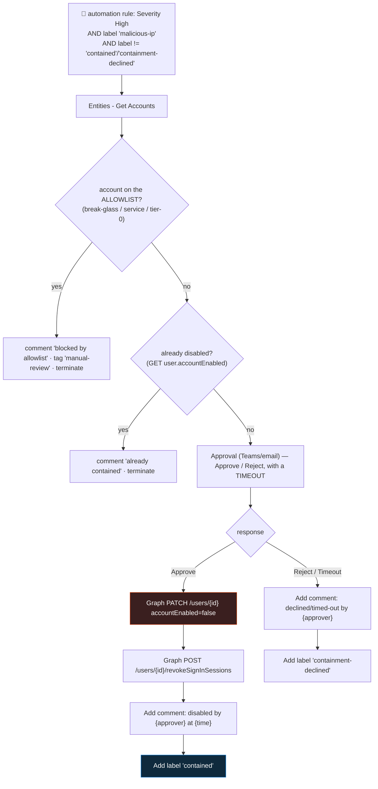

<div align="center">

# 🔄 Step 34 · Response actions with approval

### *The first automation that changes the world — gated behind a human "yes"*

[](../README.md)
[](#)
[](#)

</div>

---

## 🎯 Goal

`PB-Contain-User-Approval` — a playbook that, on a **high-confidence** high-severity incident, posts
an **approval** to Teams/email; on **Approve** it disables the Entra account, revokes its sessions,
comments who approved and what happened, and tags `contained`; on **Reject** it comments and tags
`containment-declined`. Proven end-to-end on a **throwaway** test user, both paths.

> [!IMPORTANT]
> **Lab only.** Point this at a disposable test account (`resp-test@<your-tenant>.onmicrosoft.com`)
> in your isolated tenant. Never at a real user. Disabling and session-revocation are reversible;
> that is not a reason to be casual with them.

## 🧠 Why this step

Everything before this — notification, enrichment — was **read-only**. This is the first playbook
that **acts**: it disables an account, cuts its sessions, and (optionally) isolates a device. That
crosses a line, and the thing that makes it *deployable* rather than terrifying is the **approval
gate**: the playbook does the fiddly, correct, fast work (find the account, disable it the right
way, revoke sessions, log it), but a human makes the *decision*.

You build it end to end here so you understand:

- **How much privilege a real response needs** — a Graph app role on the MI, not just Sentinel RBAC.
- **Why "disable" is more than one call** — disabling without revoking sessions leaves valid tokens
  live for up to an hour.
- **Where the guardrails go** — this step adds the two non-negotiable ones (an **allowlist** so you
  can never disable a break-glass/service/tier-0 account, and an **idempotency** check); the full
  guardrail set is [step 37](../37-guardrails-and-conditions/README.md).

What people get wrong: **no approval gate** (one false positive locks out a real user); **MI
over-permissioned** (`Directory.ReadWrite.All` when `User.EnableDisableAccount.All` would do);
**no timeout on the approval** (the run hangs for days); **no session revocation** (the "disabled"
account keeps working for ~an hour); or **testing on a real account** (don't).

## ✅ Prerequisites

- [Step 32](../32-playbook-managed-identity-and-permissions/README.md) — the playbook MI with the
  Graph app role **`User.ReadWrite.All`** (or the narrower **`User.EnableDisableAccount.All`** +
  **`User.RevokeSessions.All`**), and (for device isolation) **`Machine.Isolate`** on the
  WindowsDefenderATP resource.
- [Step 33](../33-enrich-an-incident/README.md) — the `malicious-ip` tag exists as a confidence
  signal.
- A **throwaway test user** `resp-test@<tenant>` you can disable and re-enable.
- A Teams channel or email you receive at, for the approval.

## 🧭 Concepts



### The two-call disable

| Call | What it does | Without it |
|---|---|---|
| `PATCH /users/{id}` `{"accountEnabled": false}` | Blocks **new** authentications | — |
| `POST /users/{id}/revokeSignInSessions` | Invalidates **existing** refresh tokens | Existing access tokens stay valid until expiry (~1h; near-instant only with Continuous Access Evaluation) |

Both are needed for real containment. Both are **reversible** (`accountEnabled: true`; sessions
just re-establish on next sign-in).

### How it works under the hood

- **Approval**: *"Start and wait for an approval"* (Approvals connector → email + the approvals
  centre) or *"Post an adaptive card and wait for a response"* (Teams, in-channel buttons). Set a
  **Timeout** (`PT4H` say) on the wait action — otherwise the run waits up to the Logic App maximum
  (~30 days) and you can't tell a hung approval from a slow one.
- **The Graph calls** use the HTTP action with **Authentication: Managed identity**, audience
  `https://graph.microsoft.com`. The MI's app role is what authorises them — the `AuditLogs` entry
  will show the **playbook's identity** as the initiator, which is exactly what an incident review
  wants.
- **Device isolation** (optional): `POST https://api.securitycenter.microsoft.com/api/machines/{id}/isolate`
  body `{"Comment": "Sentinel INC-<n>", "IsolationType": "Full"}`, audience
  `https://api.securitycenter.microsoft.com`, MI app role `Machine.Isolate`. Also reversible
  (`/unisolate`). There is a built-in *"Isolate endpoint"* playbook template you can start from.
- **Guardrails**: the **allowlist** (a watchlist of accounts the playbook must refuse) and the
  **idempotency** check (GET the user first; skip if already disabled) go in *before* the approval.
  [Step 37](../37-guardrails-and-conditions/README.md) adds blast-radius caps, business-hours
  logic, and full logging.
- **Loop guard**: the playbook adds `contained` / `containment-declined`; the automation rule
  condition excludes incidents that already have either.

### Vocabulary

| Term | Meaning |
|---|---|
| **Gated / approval-based response** | An automated action that pauses for a human decision before executing. |
| **Containment** | Actions that limit an attacker's access without eradicating them (disable, isolate, revoke). |
| **Session revocation** | Invalidating a user's existing tokens so a disable takes effect now, not in an hour. |
| **Break-glass account** | An emergency-access admin account that must never be disabled by automation. |
| **Allowlist (deny-to-act list)** | Accounts/hosts the response playbook is forbidden to touch. |
| **Idempotency** | Running the playbook twice has the same effect as once (skip if already done). |

### Where this fits

The milestone of the automation phase — **first automated response**. It reads the
[step 33](../33-enrich-an-incident/README.md) `malicious-ip` tag as its confidence gate, uses the
[step 32](../32-playbook-managed-identity-and-permissions/README.md) MI + Graph app role, and is
hardened fully in [step 37](../37-guardrails-and-conditions/README.md). The NRT privileged-role rule
([step 23](../23-nrt-rules/README.md)) is a natural trigger for a variant of this.

### Design rationale

Microsoft ships the response connectors (disable user, isolate device, block IP) but leaves the
**decision** to you deliberately — machine-speed *containment* with human *authorisation* is the
model most SOCs can actually defend. The approval gate is the smallest change that makes destructive
automation safe to enable.

## 🖱️ Do it — portal

1. **Allowlist watchlist.** Create `ResponseAllowlist` ([step 24](../24-watchlists/README.md)) with
   your break-glass, service, and tier-0 admin accounts. SearchKey `UserPrincipalName`.
2. **Create the playbook.** Automation → **Create playbook with incident trigger** →
   `PB-Contain-User-Approval`. MI on; grant it Sentinel Responder.
3. **Actions:**
   - **Entities - Get Accounts.**
   - **For each** account:
     - **Run query and list results**: `_GetWatchlist('ResponseAllowlist') | where tolower(UserPrincipalName) == tolower('@{items('For_each')?['Name']}')`. **Condition**: if it returned a
       row → **Add comment** "Blocked by allowlist: protected account" → **Add label**
       `manual-review` → **Terminate** (status: Succeeded).
     - **HTTP GET** `https://graph.microsoft.com/v1.0/users/@{items('For_each')?['Name']}?$select=accountEnabled` (MI). **Condition**: if `accountEnabled == false` → **Add comment** "Already disabled"
       → **Terminate**.
     - **Approvals — Start and wait for an approval** (or Teams adaptive card). Title:
       `Disable @{items('For_each')?['Name']}? — incident @{triggerBody()?['object']?['properties']?['incidentNumber']}`. Options `Approve`, `Reject`. **Timeout `PT4H`.**
     - **Condition** on the outcome:
       - **Approve**:
         - **HTTP PATCH** `https://graph.microsoft.com/v1.0/users/@{items('For_each')?['Name']}` body `{ "accountEnabled": false }` (MI, audience `https://graph.microsoft.com`).
         - **HTTP POST** `https://graph.microsoft.com/v1.0/users/@{items('For_each')?['Name']}/revokeSignInSessions` (MI).
         - *(optional)* **HTTP POST** the Defender isolate endpoint for the Host entity.
         - **Add comment**: `Disabled @{items('For_each')?['Name']} and revoked sessions. Approved by @{body('Start_and_wait_for_an_approval')?['responder']?['userPrincipalName']} at @{utcNow()}.`
         - **Add label** `contained`; **Update incident** status `Active`.
       - **Reject / Timeout**:
         - **Add comment**: `Containment declined/timed-out. Responder: @{...}.`
         - **Add label** `containment-declined`.

## 💻 Do it — the Graph calls + automation rule

```
PATCH https://graph.microsoft.com/v1.0/users/<upn>
  Authentication: Managed identity   Audience: https://graph.microsoft.com
  Body: { "accountEnabled": false }

POST  https://graph.microsoft.com/v1.0/users/<upn>/revokeSignInSessions
  Authentication: Managed identity   Audience: https://graph.microsoft.com
```

**Automation rule** — trigger *incident created*; conditions:
*Severity **equals** High* **AND** *Tag **contains** `malicious-ip`* **AND** *Tag **does not
contain** `contained`* **AND** *Tag **does not contain** `containment-declined`*; action *Run
playbook `PB-Contain-User-Approval`*.

## 🧪 Validate — both paths, on the throwaway user

1. Confirm `resp-test@<tenant>` is **enabled** (`az ad user show --id resp-test@YOURTENANT --query accountEnabled`).
2. Simulate a High incident naming that account and coming from an IP that
   [step 33](../33-enrich-an-incident/README.md) tags `malicious-ip`.
3. **Approve** the request.

```bash
az ad user show --id resp-test@YOURTENANT.onmicrosoft.com \
  --query "{upn:userPrincipalName, enabled:accountEnabled}" -o table
```

```kusto
AuditLogs
| where TimeGenerated > ago(20m)
| where OperationName in ("Update user", "Disable account")
| project TimeGenerated, Initiator = tostring(InitiatedBy.app.displayName),
          InitiatorId = tostring(InitiatedBy.app.appId),
          Target = tostring(TargetResources[0].userPrincipalName),
          Change = tostring(TargetResources[0].modifiedProperties)
```

| Check | Healthy | Unhealthy |
|---|---|---|
| `accountEnabled` | **false** after Approve | still true → PATCH failed (403 → app role; 400 → wrong id) |
| `AuditLogs` initiator | the **playbook's MI** (app display name), not you | your UPN → the HTTP action isn't using MI |
| Incident comment | names the **approver** and the timestamp | generic / missing → the responder expression is wrong |
| Incident labels | `contained` | missing → the Approve branch didn't complete |
| **Reject path** | re-run, click **Reject** → account **stays enabled**, label `containment-declined` | account disabled on reject → the branch condition is inverted |
| **Allowlist** | add `resp-test` to `ResponseAllowlist`, re-run → comment "Blocked by allowlist", account untouched | disabled anyway → allowlist check is after the action, or not terminating |
| **Idempotency** | disable `resp-test` manually, re-run → comment "Already disabled", no duplicate action | |

4. **Re-enable the test user** (`accountEnabled: true`) and close the incidents.

**You should see** the account disabled only via Approve, the audit trail attributing it to the
playbook, the approver captured, and the allowlist + idempotency guards both firing. This is the
**first automated response** milestone.

## 🚩 Common mistakes

| 🚩 Mistake | Why it bites |
|---|---|
| No approval gate | One false positive locks out a real user or quarantines a prod server |
| No **allowlist** check before the action | A misfire disables your break-glass account |
| No **idempotency** check | Re-runs double-act or error confusingly |
| No **timeout** on the approval | The run hangs for days; you can't distinguish hung from slow |
| Disable without `revokeSignInSessions` | The account keeps working for up to an hour |
| MI with `Directory.ReadWrite.All` | Far more than disable needs — narrow it ([step 32](../32-playbook-managed-identity-and-permissions/README.md)) |
| No loop guard | The status/label update re-triggers the automation rule |
| Testing on a real account | Do not. Ever. |
| Using `delete` instead of `disable` | Deletion is irreversible; containment must be reversible |

## 🩺 Troubleshooting

| Symptom | Likely cause | Fix |
|---|---|---|
| PATCH returns `403 Authorization_RequestDenied` | MI lacks the Graph app role, or it's not propagated | Grant `User.ReadWrite.All` / `User.EnableDisableAccount.All`; wait; verify via appRoleAssignments |
| PATCH `403` on a *privileged* target user | Disabling a user with an admin role can need more (RoleManagement) | Test on a non-privileged throwaway; document the limitation |
| PATCH `400` | Wrong user id — `@{items('For_each')?['Name']}` isn't a UPN/GUID | Use the account entity's `Name` (UPN) or `AadUserId` |
| Approval never arrives | Approvals connector not authorised, or the person has no approvals access | Re-authorise; use the Teams adaptive-card variant |
| Run stuck for hours | No timeout on the wait action | Set Timeout `PT4H`; handle the timeout branch |
| Account disabled but sessions still work | `revokeSignInSessions` skipped or failed | Add/fix that call; confirm the MI has the permission |
| Playbook loops | Label/status update re-triggers the automation rule | Automation rule condition excludes `contained`/`containment-declined` |
| Isolate call `403` | MI lacks `Machine.Isolate` on WindowsDefenderATP, or wrong audience | Grant the app role on appId `fc780465-2017-40d4-a0c5-307022471b92`; audience `https://api.securitycenter.microsoft.com` |

## 🎓 Deepen your understanding

1. Time the whole chain: incident created → automation rule → playbook → approval prompt → approve → account disabled. Where's the slowest link, and is it the *approval* or the *plumbing*?
2. `revokeSignInSessions` invalidates refresh tokens but not access tokens. What's the residual exposure window, and how does **Continuous Access Evaluation** change it?
3. The allowlist is a watchlist. What happens if the watchlist service is slow or the `_GetWatchlist` call fails — does your playbook **fail open** (disable anyway) or **fail closed** (refuse)? Which do you want, and how do you enforce it?
4. Add device isolation to the Approve branch for the Host entity. Isolation is also reversible — write the "release from isolation" companion action and decide who triggers it.
5. This playbook needs a High incident + `malicious-ip`. Design the trigger for the [step 23](../23-nrt-rules/README.md) NRT "Global Admin granted" rule instead — what's the confidence gate there, and would you auto-approve any part of it?

## 🗒️ Log your run

Copy [`_templates/STEP-LOG-TEMPLATE.md`](../_templates/STEP-LOG-TEMPLATE.md) into this folder as
`LOG.md`. Record: **both** the Approve and Reject paths, the `accountEnabled: false` proof, the
`AuditLogs` entry showing the **MI as initiator**, the captured approver, and the allowlist +
idempotency guard results. Note that you **re-enabled** the test user. This is a milestone — mark it.

## 📚 Microsoft Learn

- [Automate threat response with playbooks — response actions](https://learn.microsoft.com/en-us/azure/sentinel/tutorial-respond-threats-playbook)
- [Sentinel SOAR use cases](https://learn.microsoft.com/en-us/azure/sentinel/sentinel-soar-use-cases)
- [Microsoft Graph — update user (accountEnabled)](https://learn.microsoft.com/en-us/graph/api/user-update)
- [Microsoft Graph — revokeSignInSessions](https://learn.microsoft.com/en-us/graph/api/user-revokesigninsessions)
- [Isolate a device with the Microsoft Defender for Endpoint API](https://learn.microsoft.com/en-us/defender-endpoint/api/isolate-machine)
- [Approvals in Azure Logic Apps](https://learn.microsoft.com/en-us/connectors/approvals/)
- [Continuous Access Evaluation](https://learn.microsoft.com/en-us/entra/identity/conditional-access/concept-continuous-access-evaluation)

---

<div align="center">
<sub>

[⬅ Prev: 33 · Enrich an incident](../33-enrich-an-incident/README.md) &nbsp;·&nbsp; [🦅 All steps](../README.md) &nbsp;·&nbsp; [Next: 35 · Automation rules for triage ➡](../35-automation-rules-triage/README.md)

</sub>
</div>
