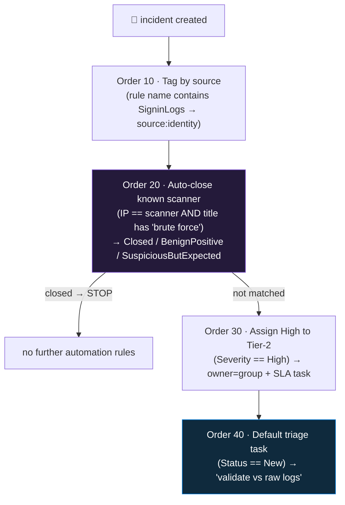

<div align="center">

# 🔄 Step 35 · Automation rules for triage

### *Assign, tag, re-severity, auto-close — the first 60 seconds of every incident, done for free*

[](../README.md)
[](#)
[](#)

</div>

---

## 🎯 Goal

A small set of **ordered** automation rules that, before an analyst opens anything: tag incidents by
data source, **auto-close** a known-benign pattern with the right classification, assign High
incidents to a queue with an SLA task, and add a default triage task to everything else. Proven with
three test incidents that each get handled differently.

## 🧠 Why this step

Automation rules are the **cheapest, safest, highest-frequency** automation in Sentinel. They run in
the Sentinel service — **instant, free, no Logic App** — and they can do the mechanical triage an
analyst would otherwise do on every single incident: *what data source is this? who owns it? is this
the scanner again? what's the first task?*

Done well, an analyst opening the queue sees incidents that are already **routed, tagged, and
prioritised**, with the obvious benign ones already closed and classified. Done badly — one
over-broad "close benign" rule ordered first — real incidents get silently closed and nobody
notices for weeks.

What people get wrong: a **broad auto-close rule at Order 1** (matches and closes things it
shouldn't); **assigning to an individual** (they go on leave, incidents pile up unowned); **no
expiration** on a rule that was only meant to cover a maintenance window; or **suppressing an
analytics rule** (which stops it running — [step 22](../22-scheduling-lookback-and-coverage-gaps/README.md))
when they meant to **auto-close its incidents** (which keeps the detection running and just tidies
the queue).

## ✅ Prerequisites

- [Step 29](../29-automation-rules-vs-playbooks/README.md) — the router/worker split.
- [Step 20](../20-entity-mapping-and-custom-details/README.md) — entity mapping and tags, which the
  conditions and actions key off.
- Some incident volume — run the [step 19](../19-write-a-scheduled-rule/README.md) sims from
  different IPs, or enable a couple more templates.

## 🧭 Concepts

### Conditions and actions

**Conditions** (grouped AND/OR): Title, Description, Severity, Status, Tactics, **Analytics rule
name**, Alert product name, Incident provider, **Tag**, and **entity properties** (IP address,
Account name, Host name) and **custom details**. On an *incident-updated* trigger you can also
condition on *which property changed*.

**Actions**: **Assign owner** (user *or* group) · **Change status** (+ classification + reason) ·
**Change severity** · **Add tags** · **Add task** · **Run playbook(s)**.

**Order** (ascending): rules run in Order. **An automation rule that closes an incident stops
further automation rules from running on that incident** — so put auto-close rules *after* any
tagging you still want, or accept that closed incidents skip the rest.



### Auto-close vs analytics-rule suppression

| | Auto-close automation rule | Analytics-rule suppression ([step 22](../22-scheduling-lookback-and-coverage-gaps/README.md)) |
|---|---|---|
| The detection | keeps running; alerts still land in `SecurityAlert` | **stops running** for N hours after firing |
| The incident | created, then immediately Closed + classified | not created |
| Audit trail | full — you can see what was closed and why | the rule just didn't run |
| Reversible | yes (re-open) | n/a |
| Use for | a *precisely characterised* benign pattern you still want a record of | a slow-moving condition where re-alerting adds nothing |

Prefer **auto-close** for triage tidying — it's auditable and reversible.

### How it works under the hood

- `Microsoft.SecurityInsights/automationRules`. `triggeringLogic` has `triggersOn` (Incidents /
  Alerts), `triggersWhen` (Created / Updated), and `conditions`. `actions` is an ordered array of
  `ModifyProperties` / `AddIncidentTask` / `RunPlaybook`.
- **Classification** on close: `TruePositive` / `BenignPositive` / `FalsePositive` / `Undetermined`,
  with a `classificationReason` — for BenignPositive that's **`SuspiciousButExpected`** (a scanner,
  a pentest, an approved admin task); for FalsePositive it's `IncorrectAlertLogic` / `InaccurateData`.
- **Expiration** (`triggeringLogic.expirationTimeUtc`): the rule auto-deletes after that time — use
  it for maintenance windows.
- **Assign to a group**: pass an Entra group's object ID — incidents land in the group's queue, not
  on a person.
- A **`RunPlaybook`** action needs the Sentinel SP's Automation Contributor grant
  ([step 05](../05-rbac-and-roles/README.md)).

### Vocabulary

| Term | Meaning |
|---|---|
| **Automation rule** | No-code Sentinel rules engine: trigger → conditions → ordered actions. |
| **Order** | The ascending priority in which automation rules evaluate; closing stops the chain. |
| **Auto-close** | An automation rule action that closes + classifies an incident immediately. |
| **Classification / reason** | Why an incident was closed — the data [step 26](../26-tuning-a-noisy-rule/README.md) uses to measure precision. |
| **SLA task** | An incident task with a deadline expectation ("confirm containment within 30 min"). |
| **Expiration** | An optional time after which the automation rule deletes itself. |

### Where this fits

Automation rules are the router for the whole phase — [step 30](../30-first-playbook-notify/README.md)+
playbooks are invoked *by* them. This step is where you build the triage layer;
[step 37](../37-guardrails-and-conditions/README.md) is guardrails on the *response* rules;
[step 26](../26-tuning-a-noisy-rule/README.md) uses auto-close as tuning rung 4;
[step 55](../55-repositories-cicd/README.md) deploys them as code.

### Design rationale

Automation rules exist so the free, instant, low-risk decisions don't pay the Logic App tax and
don't need an engineer to build a workflow. Making auto-close terminate the chain prevents a closed
incident from being re-opened or re-tagged by a later rule.

## 🖱️ Do it — build four rules

**Automation → Automation rules → + Create → Automation rule** for each:

| Order | Name | Trigger | Conditions | Actions |
|---|---|---|---|---|
| 10 | `AR · Tag by source` | Incident created | *Analytics rule name* **contains** `Signin` → tag `source:identity`; a second rule for `SecurityEvent`/`4625` → tag `source:endpoint` | Add tags |
| 20 | `AR · Auto-close known scanner` | Incident created | *Entity IP address* **equals** `<your lab scanner IP>` **AND** *Title* **contains** `brute force` | Change status → **Closed**, classification **BenignPositive**, reason **SuspiciousButExpected**; Add tag `auto-closed` |
| 30 | `AR · Assign High to Tier-2` | Incident created | *Severity* **equals** High | Assign owner → **Tier-2 group**; Add task `Confirm containment within 30 min` |
| 40 | `AR · Default triage task` | Incident created | *Status* **equals** New | Add task `Validate the alert against raw logs; document the classification on close` |

## 💻 Do it — automation rule as ARM (for [step 55](../55-repositories-cicd/README.md))

```json
{
  "type": "Microsoft.SecurityInsights/automationRules",
  "apiVersion": "2024-09-01",
  "name": "[guid('AR-Auto-close-known-scanner')]",
  "properties": {
    "displayName": "AR - Auto-close known scanner",
    "order": 20,
    "triggeringLogic": {
      "isEnabled": true,
      "triggersOn": "Incidents",
      "triggersWhen": "Created",
      "conditions": [
        { "conditionType": "Property", "conditionProperties": { "propertyName": "IncidentTitle", "operator": "Contains", "propertyValues": ["brute force"] } },
        { "conditionType": "Property", "conditionProperties": { "propertyName": "IncidentRelatedEntitiesIPAddress", "operator": "Equals", "propertyValues": ["<scanner-ip>"] } }
      ]
    },
    "actions": [
      { "order": 1, "actionType": "ModifyProperties", "actionConfiguration": { "status": "Closed", "classification": "BenignPositive", "classificationReason": "SuspiciousButExpected", "classificationComment": "Known lab scanner IP" } },
      { "order": 2, "actionType": "AddIncidentTask", "actionConfiguration": { "title": "Auto-closed: known scanner IP (review monthly)" } }
    ]
  }
}
```

## 🧪 Validate

Run three test incidents: **(a)** the [step 19](../19-write-a-scheduled-rule/README.md) attack from
your **scanner IP**; **(b)** the same from a **different** IP; **(c)** anything **High** severity.

```kusto
SecurityIncident
| where TimeGenerated > ago(1h)
| project IncidentNumber, Title, Severity, Status, Classification, ClassificationReason,
          Owner = tostring(Owner.assignedTo), Labels,
          TaskCount = array_length(todynamic(Tasks))
| sort by IncidentNumber desc
```

| Incident | Expected |
|---|---|
| (a) scanner IP | `Status = Closed`, `Classification = BenignPositive`, reason `SuspiciousButExpected`, label `auto-closed` — and **no** default triage task (auto-close stopped the chain) |
| (b) different IP | `Status = New`, label `source:endpoint`, has the "validate vs raw logs" task |
| (c) High severity | Owner = Tier-2 group, has the "confirm containment within 30 min" task, label `source:*` |

**You should see** each incident handled per its rules, and the **Order** effect on (a): the
auto-close rule (20) ran, closed it, and rules 30/40 did **not** run on it.

## 🚩 Common mistakes

| 🚩 Mistake | Why it bites |
|---|---|
| A broad "close benign" rule at Order 1 | Silently closes real incidents that happen to match its loose condition |
| **Suppressing the analytics rule** when you meant to auto-close its incidents | Suppression stops the detection; auto-close keeps it and tidies the queue |
| Assigning to an **individual** | They go on leave; incidents pile up unowned — assign to a **group** |
| No **expiration** on a maintenance-window rule | It outlives the reason it existed and keeps closing/assigning |
| Auto-close before the tag rules | The tags you wanted never get applied (chain stopped) |
| Wrong `classificationReason` string | `SecurityTestingTool` isn't valid — BenignPositive uses `SuspiciousButExpected` |
| Conditioning on a tag a playbook adds, on an incident-**created** trigger | The tag isn't there yet at creation — use an incident-**updated** trigger |

## 🩺 Troubleshooting

| Symptom | Likely cause | Fix |
|---|---|---|
| Rule never runs | Trigger wrong (created vs updated), condition too strict, or a lower-Order rule closed the incident first | Check the rule's run history; loosen one condition; check Order |
| Auto-close rule closed a real incident | Condition too broad (e.g. just "title contains brute force", any IP) | Add the IP-equals condition; scope it tightly; add an expiration and review |
| Tag-by-source rule tags nothing | The analytics rule name doesn't contain the substring you matched on | Match on something stable — the rule name, or a tactic, or a data-source custom detail |
| Assigned incidents don't appear in the group's queue | Assigned to a group that isn't security-enabled, or the wrong object ID | Use a mail-enabled/security group; verify the object ID |
| Classification not set on close | `classificationReason` invalid for the `classification` | BenignPositive → `SuspiciousButExpected`; FalsePositive → `IncorrectAlertLogic`/`InaccurateData` |
| Rule closed the incident but later re-opened | Another automation rule or a playbook re-opened it, or `reopenClosedIncident` on the analytics rule's grouping | Set the analytics-rule grouping `reopenClosedIncident: false` ([step 21](../21-alert-and-event-grouping/README.md)) |
| Two rules conflict (one assigns, one closes) | Both match, Order lets both run before the close | Close in the earliest-Order rule, or make conditions mutually exclusive |

## 🎓 Deepen your understanding

1. Your `AR · Auto-close known scanner` closes incidents from one IP. Write the *safest possible* version of that condition. What extra conditions (rule name, low fail count, no successful logon) make it hard to accidentally close a real attack?
2. Build an **incident-updated** automation rule: when the `malicious-ip` tag is added (by [step 33](../33-enrich-an-incident/README.md)), raise severity to High and assign to Tier-2. Why does this need the *updated* trigger, and how do you stop it looping?
3. Order matters. You have: tag-by-source (10), auto-close-scanner (20), assign-High (30). A High-severity incident *from the scanner* arrives. What happens, and is that what you want? Re-order if not.
4. Auto-close writes a classification. [Step 26](../26-tuning-a-noisy-rule/README.md) measures precision from classifications. If you auto-close 40% of a rule's incidents as BenignPositive, what should you actually do about that rule?
5. An automation rule assigns to "Tier-2 group". In a real MSSP ([step 54](../54-multi-tenant-and-lighthouse/README.md)) that group is in *your* tenant and the incident is in the *customer's*. Does group assignment work across the Lighthouse boundary? How would you check?

## 🗒️ Log your run

Copy [`_templates/STEP-LOG-TEMPLATE.md`](../_templates/STEP-LOG-TEMPLATE.md) into this folder as
`LOG.md`. Record: the four rules (name, Order, conditions, actions), the three test incidents and
how each was auto-handled, and evidence the Order/stop-the-chain behaviour worked on the
scanner-IP incident. Export the rules to `artifacts/automation-rules/`.

## 📚 Microsoft Learn

- [Automate incident handling with automation rules](https://learn.microsoft.com/en-us/azure/sentinel/automate-incident-handling-with-automation-rules)
- [Create and use Microsoft Sentinel automation rules](https://learn.microsoft.com/en-us/azure/sentinel/create-manage-use-automation-rules)
- [Incident tasks in Microsoft Sentinel](https://learn.microsoft.com/en-us/azure/sentinel/incident-tasks)
- [automationRules ARM template reference](https://learn.microsoft.com/en-us/azure/templates/microsoft.securityinsights/automationrules)

---

<div align="center">
<sub>

[⬅ Prev: 34 · Response actions with approval](../34-response-actions-with-approval/README.md) &nbsp;·&nbsp; [🦅 All steps](../README.md) &nbsp;·&nbsp; [Next: 36 · Alert vs incident vs entity triggers ➡](../36-alert-vs-incident-vs-entity-triggers/README.md)

</sub>
</div>
