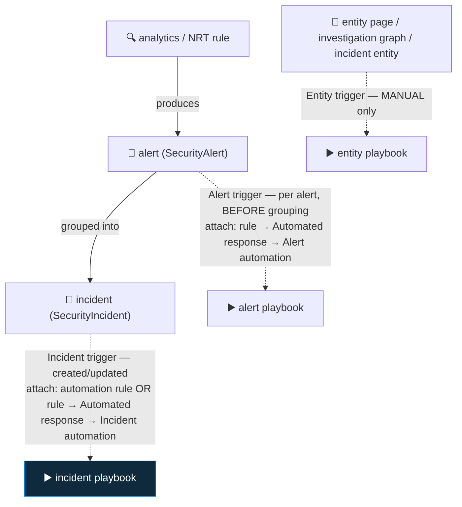

<div align="center">

# 🔄 Step 36 · Alert vs incident vs entity triggers

### *Three playbook triggers, three payload shapes, three ways to attach — pick the right one*

[](../README.md)
[](#)
[](#)

</div>

---

## 🎯 Goal

You've built one playbook of each trigger type — **incident**, **alert**, **entity** — inspected the
distinct `triggerBody()` shape each produces in run history, and you can state which trigger fits a
given job and how it's attached.

## 🧠 Why this step

Choosing the wrong trigger is one of the most common playbook bugs, and it fails in a confusing way:
the playbook saves, attaches, and runs — but every expression returns `null` because the payload
isn't the shape the expression expects. The three triggers differ on **all three** of:

- **What context you get** — a whole incident, a single alert, or a single entity.
- **When it fires** — incident created/updated, per alert (before grouping), or on-demand only.
- **How you attach it** — automation rule, the analytics rule's *alert* automation slot, or a
  manual "Run playbook" from an entity.

Get this right once and every playbook in the phase slots in cleanly. Get it wrong and you spend an
hour debugging `triggerBody()?['object']?['properties']?['title']` returning nothing because you're
actually on the alert trigger.

## ✅ Prerequisites

- [Step 30](../30-first-playbook-notify/README.md), [31](../31-sentinel-connector-triggers-and-actions/README.md)
  — you can build a playbook and read its trigger output.
- `DET-IDENTITY-001` producing alerts and incidents to test against.

## 🧭 Concepts



### The three triggers

| Trigger | Fires | Attach via | Payload (`triggerBody()`) | Use for |
|---|---|---|---|---|
| **Incident** | Incident **created / updated** | Automation rule, **or** analytics rule → Automated response → *Incident automation* | `object` = the incident: `object.id` (ARM Id), `object.properties.{title, severity, status, incidentNumber, incidentUrl, labels, relatedEntities[], additionalData.alertsCount}` | Triage, enrichment, response, notification — **the default** |
| **Alert** | Each **alert** the rule emits, **before** grouping/incident creation | **Only** analytics/NRT rule → Automated response → *Alert automation* | The alert **directly**: `AlertDisplayName`, `Severity`, `Entities[]`, `AlertType`, `SystemAlertId`, `WorkspaceId`, `ExtendedProperties` — **no incident wrapper** | Per-alert action; the rule doesn't create incidents (informational); high-volume where each row matters |
| **Entity** | **On demand only** — analyst clicks "Run playbook" on an entity | Entity page, investigation graph, or an incident's entity → **Run playbook** | A **single entity** object: `Type` (`account`/`ip`/`host`/`url`/`filehash`), plus that type's fields (`Address`, `Name`, `HostName`…) | Analyst-initiated "tell me everything about this X" dossiers |

### The critical constraints

- **Incident-trigger playbooks cannot be attached to the *alert* automation slot**, and vice versa
  — the payloads are incompatible.
- **Alert-triggered playbooks run before the incident exists.** "Add comment to incident" may fail;
  there's an *"Alert - Get incident"* action but the incident may not be created yet. If you need
  the incident, use the incident trigger.
- **Entity-triggered playbooks never run automatically.** There is no automation rule or analytics
  rule setting that fires them — they are a manual tool for analysts.

### How it works under the hood

- All three are the **Microsoft Sentinel** Logic Apps connector; the trigger you pick when creating
  the playbook (*"Playbook with incident trigger"* / *"…alert trigger"* / entity) sets the trigger
  operation and therefore the JSON schema of `triggerBody()`.
- The **incident** trigger's `relatedEntities` and the **alert** trigger's `Entities` are both
  arrays but shaped differently — the `Entities - Get <type>` actions ([step 31](../31-sentinel-connector-triggers-and-actions/README.md)) normalise both.
- An **entity** playbook has no incident to write back to — it returns its result in the **run
  output**, posts to Teams/email, or writes to a custom table via the Logs Ingestion API
  ([step 13](../13-custom-logs-and-dcr-transformations/README.md)).

### Vocabulary

| Term | Meaning |
|---|---|
| **Incident trigger** | Fires on incident create/update; payload is the whole incident. |
| **Alert trigger** | Fires per alert, before grouping; payload is a single alert, no incident. |
| **Entity trigger** | Manual-only; payload is one entity. |
| **Alert automation** | The section of a rule's Automated response tab for *alert*-triggered playbooks. |
| **`triggerBody()`** | The Logic App expression for the trigger's output — shape depends on trigger type. |
| **Run playbook (on entity)** | The analyst action that manually invokes an entity-triggered playbook. |

### Where this fits

This is the "which trigger" decision for every playbook in the phase.
[Step 30](../30-first-playbook-notify/README.md)/[33](../33-enrich-an-incident/README.md)/[34](../34-response-actions-with-approval/README.md) are incident-triggered; a per-alert quick-context
playbook is alert-triggered; an analyst IP-dossier is entity-triggered.

### Design rationale

Three triggers exist because "automate on a detection" has three meanings: act on the *correlated
picture* (incident), act on the *individual signal* before it's grouped (alert), and let a human
*pull* context for one thing (entity). One trigger couldn't serve all three without a payload that's
sometimes mostly empty.

## 🖱️ Do it — build one of each

1. **Incident** — you already have `PB-Notify-Incident` ([step 30](../30-first-playbook-notify/README.md))
   and `PB-Enrich-IP-Reputation` ([step 33](../33-enrich-an-incident/README.md)). ✔️
2. **Alert** — `PB-Alert-QuickContext`:
   - Create **Playbook with alert trigger**. MI on.
   - **Run query and list results**: last 24 h of `SigninLogs` for the alert's account entity
     (get it from `triggerBody()?['Entities']` filtered to `Type == 'account'`).
   - **Compose** a one-line summary; write it to a custom table `AlertContext_CL` via the Logs
     Ingestion API, or (lab shortcut) just leave it in the run output.
   - Attach: **Analytics → `DET-IDENTITY-001` → Edit → Automated response → Alert automation →
     + Add → `PB-Alert-QuickContext`.**
3. **Entity** — `PB-Entity-IP-Dossier`:
   - Create **Playbook with entity trigger** → entity type **IP**. MI on.
   - Reputation lookup ([step 33](../33-enrich-an-incident/README.md) pattern) + **Run query** for
     `SigninLogs` / `CommonSecurityLog` hits on `triggerBody()?['Address']` over 30 days + **Compose**
     a dossier.
   - No incident — **Post to Teams** (or return in run output).
   - Run it: any incident → **Entities** → an IP → **⋯ → Run playbook → `PB-Entity-IP-Dossier`**.

## 💻 Do it — inspect payloads via CLI

```bash
RG=rg-sentinel-lab
for PB in PB-Notify-Incident PB-Alert-QuickContext PB-Entity-IP-Dossier; do
  WF=$(az resource show -g $RG -n "$PB" --resource-type Microsoft.Logic/workflows --query id -o tsv 2>/dev/null) || continue
  RUN=$(az rest --method get --url "https://management.azure.com$WF/runs?api-version=2016-06-01&\$top=1" --query "value[0].name" -o tsv)
  echo "=== $PB / run $RUN ==="
  az rest --method get --url "https://management.azure.com$WF/runs/$RUN/actions?api-version=2016-06-01" \
    --query "value[?contains(name,'trigger') || contains(name,'Compose')].{a:name, s:properties.status}" -o table
done
```

Then open each run in the portal and expand the **trigger Outputs** — that JSON is the payload.

## 🧪 Validate

Fire each: re-run the [step 19](../19-write-a-scheduled-rule/README.md) sim (incident + alert
playbooks run); manually run the entity playbook on an IP.

| Trigger | Expected `triggerBody()` shape |
|---|---|
| **Incident** | `object.properties.title` = "DET-IDENTITY-001 …", `object.properties.relatedEntities` array, `object.properties.additionalData.alertsCount` ≥ 1, `object.id` a `/providers/Microsoft.SecurityInsights/Incidents/…` ARM Id |
| **Alert** | `AlertDisplayName`, `Severity`, `Entities` array, `SystemAlertId` — **no `object` wrapper, no `incidentNumber`** |
| **Entity** | `Type` = `"ip"`, `Address` populated — a single object, no array |

```kusto
SecurityAlert | where TimeGenerated > ago(1h) and AlertName has "DET-IDENTITY-001" | project SystemAlertId, Entities
```

**You should see** three Succeeded runs with three visibly different trigger payloads, and you
should be able to say, from the shape alone, which trigger produced which.

## 🚩 Common mistakes

| 🚩 Mistake | Why it bites |
|---|---|
| Incident-trigger playbook in the *alert* automation slot (or vice versa) | Payload mismatch — every expression returns null |
| Alert-triggered playbook doing "Add comment to incident" | The incident may not exist yet at alert time |
| Expecting an entity playbook to run automatically | Entity playbooks are manual-only |
| Reading `triggerBody()?['object']?['properties']` on an alert playbook | The alert payload has no `object` wrapper |
| Building everything incident-triggered | You lose per-alert granularity where the rule is informational / high-volume |
| Entity playbook trying to update an incident it wasn't given | There's no incident context — return the result another way |

## 🩺 Troubleshooting

| Symptom | Likely cause | Fix |
|---|---|---|
| Playbook not offered when attaching to Alert automation | It's an incident-trigger playbook | Rebuild it with the alert trigger (or the right one for the job) |
| All `triggerBody()` expressions return null | Wrong trigger type for the expression paths | Check the trigger Outputs shape; rewrite paths (`object.properties.*` for incident, direct for alert) |
| Alert playbook: "Add comment" fails "Incident not found" | Incident not created yet at alert-automation time | Use *Alert - Get incident* with a retry, or move the logic to an incident playbook |
| Entity playbook never runs | Nothing triggers it automatically | Analyst must click **Run playbook** on the entity; document it |
| Entity playbook errors on `triggerBody().Entities` | Entity payload is a single entity, not an array | Use `triggerBody()?['Address']` / `['Name']` directly |
| Alert playbook fires far more often than expected | It runs **per alert**, and the rule uses `AlertPerResult` grouping | Expected — see [step 21](../21-alert-and-event-grouping/README.md); switch to incident trigger if you want one run per attack |

## 🎓 Deepen your understanding

1. Put the same 3-action logic in an incident playbook and an alert playbook for `DET-IDENTITY-001`. Fire the sim. How many times does each run, and why (hint: grouping)?
2. The alert trigger fires before the incident. Name three things you can *only* do in an incident playbook, and one thing that's *better* in an alert playbook.
3. Design an entity playbook for an **Account**: 30-day sign-in map, group memberships, recent audit changes, risk state. Where does the output go, and how does the analyst invoke it mid-investigation?
4. An informational analytics rule creates **alerts but no incidents** ([step 26](../26-tuning-a-noisy-rule/README.md) rung 5). Which trigger must its playbook use, and what would it typically do?
5. Could you build "auto-enrich every entity on incident creation" using the entity trigger? Why not — and what's the right pattern ([step 33](../33-enrich-an-incident/README.md))?

## 🗒️ Log your run

Copy [`_templates/STEP-LOG-TEMPLATE.md`](../_templates/STEP-LOG-TEMPLATE.md) into this folder as
`LOG.md`. Record: the three trigger payload shapes **side by side** (redacted JSON from run
history), which each was attached via, and one sentence on when you'd pick each. Export the three
playbooks to `artifacts/`.

## 📚 Microsoft Learn

- [Use triggers and actions in Microsoft Sentinel playbooks](https://learn.microsoft.com/en-us/azure/sentinel/playbook-triggers-actions)
- [Run a playbook manually on an entity](https://learn.microsoft.com/en-us/azure/sentinel/automate-responses-with-playbooks#run-a-playbook-manually)
- [Respond to alerts and incidents with playbooks (Automated response)](https://learn.microsoft.com/en-us/azure/sentinel/automate-responses-with-playbooks)
- [Microsoft Sentinel Logic Apps connector (trigger schemas)](https://learn.microsoft.com/en-us/connectors/azuresentinel/)

---

<div align="center">
<sub>

[⬅ Prev: 35 · Automation rules for triage](../35-automation-rules-triage/README.md) &nbsp;·&nbsp; [🦅 All steps](../README.md) &nbsp;·&nbsp; [Next: 37 · Guardrails and conditions ➡](../37-guardrails-and-conditions/README.md)

</sub>
</div>
