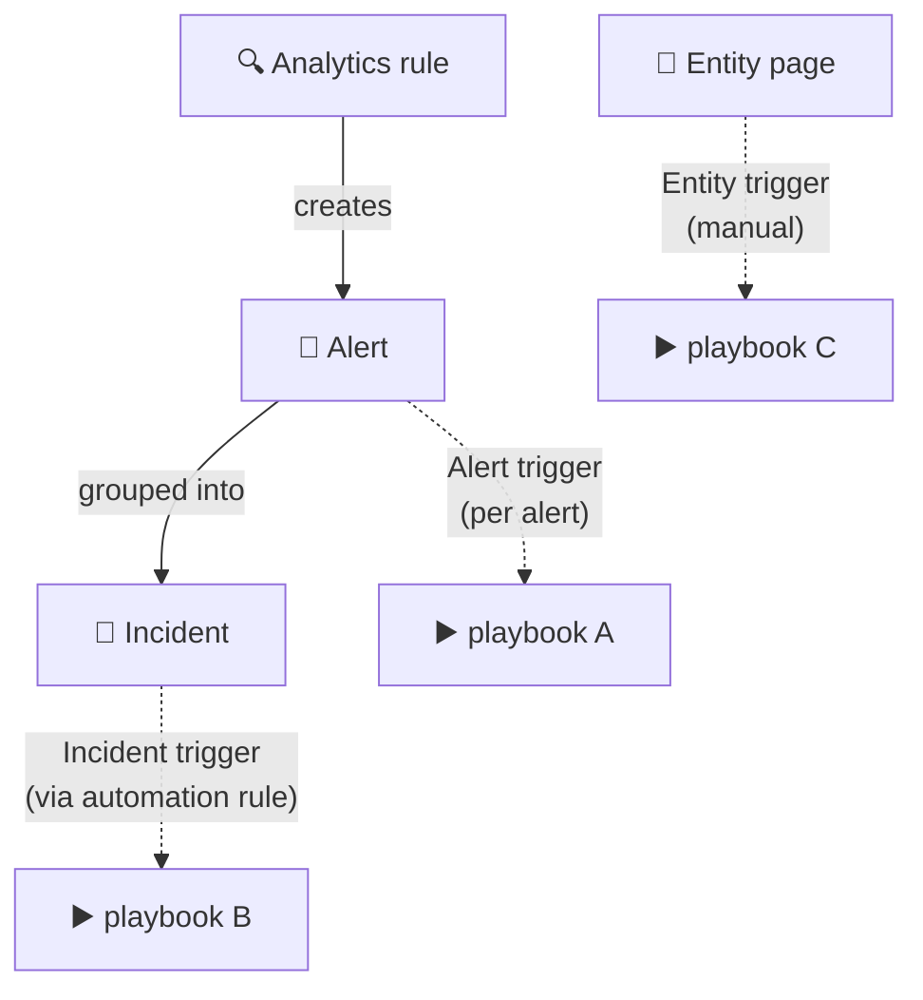

<div align="center">

# 🔄 Step 36 · Alert vs incident vs entity triggers

### *Pick the right playbook trigger for the job*

[](../README.md)
[](#)
[](#)

</div>

---

## 🎯 Goal

You've built one playbook of each trigger type and know when each is correct.

## 🧠 Why this step

Choosing the wrong trigger is a top playbook bug: the `triggerBody()` shape is different, the
context you get is different, and how you attach it is different.

## ✅ Prerequisites

- [Step 30](../30-first-playbook-notify/README.md), [31](../31-sentinel-connector-triggers-and-actions/README.md)

## 🧭 The three triggers

| Trigger | Attached via | Fires | Context you get | Use when |
|---|---|---|---|---|
| **Incident** | Automation rule (or analytics rule → Automated response) | Incident created/updated | Whole incident: all alerts, all entities, comments, tags | Triage, enrichment, response, notification — **the default** |
| **Alert** | Analytics rule → **Automated response → Alert automation** | Each alert the rule produces | One alert + its entities (no incident wrapper) | You need per-alert action, or the rule doesn't create incidents |
| **Entity** | Manual: entity page → **Run playbook**; or investigation graph | On demand | A single entity (account / IP / host / URL / filehash) | Analyst-initiated enrichment ("tell me everything about this IP") |



## 🖱️ Do it — build one of each

1. **Incident** — you already have `PB-Notify-Incident` (step 30) and `PB-Enrich-IP-Reputation`
   (step 33). ✔️
2. **Alert** — `PB-Alert-QuickLog`:
   - Trigger: *Microsoft Sentinel alert*.
   - Action: **Run query and list results** — pull the 24h context for the alert's account, write
     it to a custom table via the Logs Ingestion API (or just log to the run history for the lab).
   - Attach: **Analytics → DET-IDENTITY-001 → Automated response → + Add → Alert automation → run
     `PB-Alert-QuickLog`.**
3. **Entity** — `PB-Entity-IP-Dossier`:
   - Trigger: *Microsoft Sentinel entity (IP)*.
   - Actions: reputation lookup (step 33 pattern) + **Run query** for `SigninLogs`/`CommonSecurityLog`
     hits on that IP in 30d + **compose** a dossier. No incident to comment on — return it in the
     run output / post to Teams.
   - Run it: **any incident → Entities → an IP → ⋯ → Run playbook → `PB-Entity-IP-Dossier`**.

## 🧪 Validate

Inspect each playbook's trigger output in **Runs history**:

- **Incident**: `triggerBody().object.properties` has `title`, `severity`, `relatedEntities[]`,
  `alerts` count.
- **Alert**: `triggerBody()` has `AlertDisplayName`, `Entities[]`, **no** incident wrapper.
- **Entity**: `triggerBody()` is a single entity object with `Type: "ip"` and `Address`.

```kusto
SecurityAlert | where TimeGenerated > ago(1h) and AlertName has "DET-IDENTITY-001" | count
```

**You should see** three Succeeded runs, each with a visibly different trigger payload shape, and
you should be able to say which context each gave you.

## 🚩 Common mistakes

| 🚩 Mistake | Why it bites |
|---|---|
| Incident-trigger playbook attached to a rule's *alert* automation slot | Payload mismatch — expressions return null |
| Entity-trigger playbook expected to run automatically | Entity playbooks are manual/graph-initiated only |
| Alert-trigger playbook trying to "Add comment to incident" | The incident may not exist yet at alert time |
| Building everything as incident-triggered | You lose per-alert granularity where you need it |

## 🗒️ Log your run

`LOG.md` — the three trigger payload shapes (redacted) side by side.

## 📚 Microsoft Learn

- [Use triggers and actions in playbooks](https://learn.microsoft.com/en-us/azure/sentinel/playbook-triggers-actions)
- [Run playbooks on demand from entities](https://learn.microsoft.com/en-us/azure/sentinel/automate-responses-with-playbooks#run-a-playbook-manually-on-an-entity)
- [Set automated responses in analytics rules](https://learn.microsoft.com/en-us/azure/sentinel/automate-responses-with-playbooks#respond-to-alerts)

---

<div align="center">
<sub>

[⬅ Prev: 35 · Automation rules for triage](../35-automation-rules-triage/README.md) &nbsp;·&nbsp; [🦅 All steps](../README.md) &nbsp;·&nbsp; [Next: 37 · Guardrails and conditions ➡](../37-guardrails-and-conditions/README.md)

</sub>
</div>
