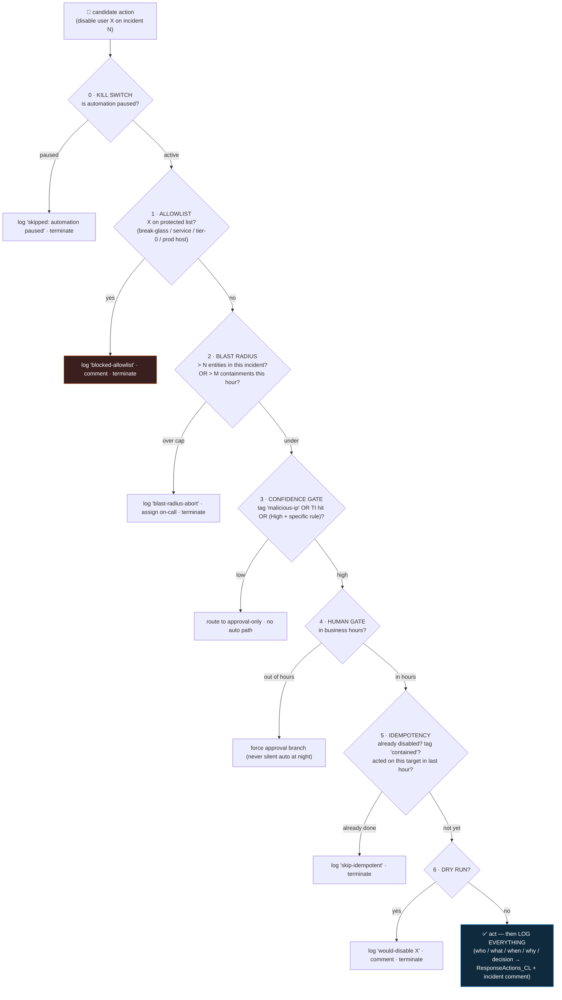

<div align="center">

# 🔄 Step 37 · Guardrails and conditions

### *What turns "automated response" from a loaded gun into something you can actually enable*

[](../README.md)
[](#)
[](#)

</div>

---

## 🎯 Goal

`PB-Contain-User-Approval` from [step 34](../34-response-actions-with-approval/README.md) has the
full guardrail set — **kill switch → allowlist → blast-radius cap → confidence gate → human gate →
idempotency → log everything**, in that order, each **failing closed** — and you've proven every
guardrail by testing the case it's supposed to block.

## 🧠 Why this step

Automated response fails in a specific, bad way: not "it didn't run" but **"it ran on the wrong
thing, at scale, in seconds"**. A false-positive detection + an auto-containment playbook + a
scanning IP that touched 50 accounts = 50 disabled users before anyone reads the alert. A rule
misfire at 3 a.m. + no human gate = an executive locked out until the on-call wakes up.

Guardrails are what make it deployable. They are not optional polish — a response playbook without
them should not be attached to an automation rule. The seven here are ordered deliberately (cheapest
and most-catastrophic-to-skip first), and every one **fails closed**: if the guardrail *check*
itself errors (the allowlist watchlist is unavailable, a query times out), the playbook **refuses to
act**, never proceeds.

Two extra safety features belong here too: a **kill switch** (one setting that pauses all automated
response instantly, for when a broad incident means you can't trust the detections) and a **dry-run
mode** (the playbook logs what it *would* do without doing it — run it this way for the first weeks
of any new response automation).

## ✅ Prerequisites

- [Step 34](../34-response-actions-with-approval/README.md) — the response playbook, with its
  allowlist and idempotency stubs.
- [Step 13](../13-custom-logs-and-dcr-transformations/README.md) — a `ResponseActions_CL` custom
  table + DCE/DCR for the logging guardrail.
- [Step 24](../24-watchlists/README.md) — watchlists for the allowlist and the kill switch.

## 🧭 Concepts — the guardrail chain



### Each guardrail

| # | Guardrail | What it prevents | How |
|---|---|---|---|
| 0 | **Kill switch** | Automation running amok during a broad incident you can't trust | First action: check a watchlist row / a Logic App parameter `automationEnabled`. If off → log + terminate. Flip it from the portal in one edit. |
| 1 | **Allowlist** | Disabling a break-glass, service, or tier-0 account; isolating a prod-critical host | Check target against `ResponseAllowlist` **before** any action. Fail closed: if the check errors, treat as *allowlisted*. |
| 2 | **Blast-radius cap** | A scanning IP → 50 disabled users; a detection misfire at scale | Abort if the incident has > N account entities, **or** > M containments have run in the last hour (rate limit across incidents, not just within one). |
| 3 | **Confidence gate** | Acting on a low-confidence alert | Require the `malicious-ip` tag ([step 33](../33-enrich-an-incident/README.md)), a TI match, or a specific high-fidelity rule. Low confidence → approval-only, no auto path. |
| 4 | **Human gate** | Silent destructive action with nobody watching | In hours → the [step 34](../34-response-actions-with-approval/README.md) approval. Out of hours → **force** the approval branch (never silent auto). |
| 5 | **Idempotency** | Double-acting on a re-triggered incident; confusing errors | Before acting: GET the target's state; check the incident tag; check the recent-action log. Already done → skip. |
| 6 | **Dry run** | A brand-new response automation acting before you trust it | A parameter; when on, log "would do X" and terminate. Run new automations this way for weeks. |
| — | **Log everything** | "We can't explain what the automation did" in the post-incident review | Every branch writes `{incident, action, target, decision, actor, timestamp, reason}` to `ResponseActions_CL` **and** an incident comment. |

### Fail-open vs fail-closed

If a guardrail's own check fails (watchlist unavailable, query 500s, approval connector down), the
playbook must **fail closed** — do not act. Build it explicitly: wrap the check, and on error set
`decision = "guardrail-check-failed"`, log, and terminate. A response playbook that fails *open*
(acts when it can't verify it's safe) is worse than no automation.

### Vocabulary

| Term | Meaning |
|---|---|
| **Guardrail** | A pre-action check that can block or downgrade an automated response. |
| **Kill switch** | A single toggle that pauses all automated response instantly. |
| **Blast radius** | How many entities one automation run could affect. |
| **Confidence gate** | A check that the incident is trustworthy enough to act on. |
| **Fail closed** | When a check can't run, refuse to act (the safe default for response). |
| **Dry run / simulation mode** | The playbook logs what it would do without doing it. |
| **`ResponseActions_CL`** | The custom table recording every response decision, for audit and metrics. |

### Where this fits

This hardens [step 34](../34-response-actions-with-approval/README.md) into something you can
actually turn on. The `ResponseActions_CL` log feeds
[step 39](../39-monitoring-playbook-runs-and-cost/README.md) (did automation do the right thing?) and
[step 57](../57-soc-optimization-and-coverage/README.md) (SOC metrics). [Step 61](../61-ir-purge-and-audit/README.md)'s "the SOC platform is compromised" runbook relies on the kill switch.

### Design rationale

The guardrails are ordered so the cheapest, most-catastrophic-to-skip checks run first (a kill
switch and allowlist cost one query each; a blast-radius abort is a `length()`), and the expensive
human gate runs only for candidates that passed everything else. Failing closed is the deliberate
asymmetry: a missed containment is recoverable; a wrongful one at scale may not be.

## 🖱️ Do it — add the chain to `PB-Contain-User-Approval`

In order, as the first actions after **Entities - Get Accounts**:

0. **Kill switch** — **Run query** `_GetWatchlist('AutomationControl') | where Setting == "response" and Value == "enabled"`. If **no row** → **Add comment** "Automated response is paused" → **Terminate**.
1. **Allowlist** — **Run query** `_GetWatchlist('ResponseAllowlist')`. **Scope** with a `Configure
   run after` → also run on failure, and treat failure as *allowlisted* (fail closed). If target ∈
   list → log + comment + **Terminate**.
2. **Blast-radius** — **Condition** `length(body('Entities_-_Get_Accounts')?['Accounts']) > 3`
   **OR** a query `ResponseActions_CL | where decision_s == "disabled" and TimeGenerated > ago(1h) | count` > 10 → log `blast-radius-abort` → **Assign owner** on-call → **Terminate**.
3. **Confidence gate** — **Condition** incident labels contain `malicious-ip` **OR** a TI-match
   query returns a row. False → route to the approval-only branch (skip any future auto path).
4. **Human gate** — **Compose** `@{convertTimeZone(utcNow(), 'UTC', 'Arabian Standard Time', 'HH')}`
   and the weekday. Outside 08–20 Mon–Fri → set a variable `forceApproval = true`.
5. **Idempotency** — **HTTP GET** `.../users/<upn>?$select=accountEnabled`; if `false` **OR**
   incident has tag `contained` **OR** a recent `ResponseActions_CL` row for this target →
   log `skip-idempotent` → **Terminate**.
6. **Dry run** — parameter `dryRun` (bool). If true → log `would-disable <upn>` → comment →
   **Terminate** *before* the approval/action.
7. **Act** (the [step 34](../34-response-actions-with-approval/README.md) approve branch), **then
   log** to `ResponseActions_CL` + a comment.

## 💻 Do it — the log write and the allowlist expression

```
// Logs Ingestion API POST body (one row per decision)
{
  "incident":  "@{triggerBody()?['object']?['properties']?['incidentNumber']}",
  "action":    "disable-user",
  "target":    "@{items('For_each')?['Name']}",
  "decision":  "@{variables('decision')}",         // disabled | blocked-allowlist | blast-radius-abort | skip-idempotent | would-disable | guardrail-check-failed
  "actor":     "@{coalesce(body('Approval')?['responder']?['userPrincipalName'], 'automation')}",
  "reason":    "@{variables('reason')}",
  "timestamp": "@{utcNow()}"
}
```

```
// allowlist decision — union of a static list and a tier-0 watchlist query; case-insensitive
@{if(
   contains(
     union(
       json('["breakglass1@contoso-lab.com","breakglass2@contoso-lab.com","svc-batch@contoso-lab.com"]'),
       select(body('vip_tier0_query')?['value'], toLower(item()?['UserPrincipalName']))
     ),
     toLower(items('For_each')?['Name'])
   ),
   'BLOCKED', 'ALLOWED')}
```

## 🧪 Validate — one negative test per guardrail

| Scenario | Expected `decision` in `ResponseActions_CL` |
|---|---|
| Kill switch: remove the `AutomationControl` row, fire an incident | `skipped-paused`, account untouched |
| Allowlist: incident targets a break-glass / tier-0 account | `blocked-allowlist`, account untouched |
| Allowlist check errors (rename the watchlist, fire) | `guardrail-check-failed` (fail **closed**), account untouched |
| Blast radius: incident with 5 account entities | `blast-radius-abort`, on-call assigned |
| Confidence: High incident **without** `malicious-ip` | routed to approval-only, no auto disable |
| Human gate: fire an incident at (simulated) 03:00 | forced to the approval branch |
| Idempotency: disable the target manually, re-fire | `skip-idempotent` |
| Dry run: `dryRun=true`, a clean should-act case | `would-disable`, account **still enabled** |
| Full pass: not protected, `malicious-ip`, in hours, 1 account, `dryRun=false` | `disabled` after approval |

```kusto
ResponseActions_CL
| where TimeGenerated > ago(1d)
| project TimeGenerated, incident_s, action_s, target_s, decision_s, actor_s, reason_s
| sort by TimeGenerated desc
```

**You should see** every guardrail block the case it's designed for, the fail-closed behaviour on a
broken check, and a complete `ResponseActions_CL` audit trail — especially for the *blocked* and
*aborted* decisions.

## 🚩 Common mistakes

| 🚩 Mistake | Why it bites |
|---|---|
| Allowlist / kill switch checked **after** the action | Too late — the damage is done |
| A guardrail that fails **open** | The playbook acts when it couldn't verify it's safe |
| No blast-radius cap | One misfire disables dozens of users in seconds |
| Rate limit only *within* an incident | Ten incidents × 3 accounts = 30 disables, each "under cap" |
| Business-hours logic in UTC treated as local | Off by hours; wrong branch |
| Guardrails but no logging | You can't reconstruct or defend what the automation did |
| No dry-run period for a new response automation | Its first real action is also its first test in production |
| Idempotency skipped | Re-triggered incidents double-act or error |

## 🩺 Troubleshooting

| Symptom | Likely cause | Fix |
|---|---|---|
| Playbook acts on an allowlisted account | Allowlist check is after the action, or the name comparison is case-sensitive | Move it first; `toLower()` both sides; fail closed on check error |
| Guardrail check error → playbook proceeds anyway | The action's *run after* isn't wired to catch failure | `Configure run after` → include *has failed*; set `decision` and terminate |
| Blast-radius cap never triggers | Counting `relatedEntities` instead of `Accounts`, or the incident really has 1 account (scanner hits one account many times) | Count the right array; also cap on containments-per-hour |
| Business-hours branch always/never fires | Timezone name wrong, or comparing a string hour to an int | Use a valid Windows timezone id; `int()` the hour |
| `ResponseActions_CL` rows missing for terminated branches | The log write is only on the "act" path | Log in **every** branch before `Terminate` |
| Kill switch doesn't stop in-flight runs | It's checked at the start; a run already past it continues | Accept it (short runs) or add a mid-run re-check before the destructive action |
| Dry-run still disabled the account | The `dryRun` condition is after the action, or defaulted false and not passed | Put the dry-run gate immediately before the approval/action; default it **true** for a new playbook |

## 🎓 Deepen your understanding

1. Order the guardrails yourself from scratch. Which one, if skipped, causes the worst outcome? Which is cheapest to run? Does your order match the chain above — and if not, why?
2. Fail-open vs fail-closed: give one guardrail where fail-open would be *tempting* (it's annoying when it blocks) and explain why fail-closed still wins.
3. The blast-radius cap is `> 3 accounts`. A real credential-stuffing hit *does* compromise many accounts. How do you avoid the cap blinding you to a genuine mass-compromise — what should happen instead of "abort silently"?
4. Design the kill switch end to end: where's the toggle, who can flip it, how fast does it take effect, and how do you make sure someone *remembers to flip it back*?
5. After 30 days, `ResponseActions_CL` has 400 rows. Write the KQL that answers: how many auto-disables, how many blocked by which guardrail, how many analysts approved vs rejected, and any target disabled more than once. What does that tell you about whether to widen or tighten the automation?

## 🗒️ Log your run

Copy [`_templates/STEP-LOG-TEMPLATE.md`](../_templates/STEP-LOG-TEMPLATE.md) into this folder as
`LOG.md`. Record: the guardrail order, the negative-test result for **each** guardrail (the decision
table above, with real `ResponseActions_CL` rows, targets redacted), the fail-closed proof, and
confirmation the dry-run parameter defaults to **true** for new automations.

## 📚 Microsoft Learn

- [Best practices for Microsoft Sentinel automation](https://learn.microsoft.com/en-us/azure/sentinel/automation/automation)
- [Microsoft Sentinel SOAR use cases](https://learn.microsoft.com/en-us/azure/sentinel/sentinel-soar-use-cases)
- [Handle errors and exceptions in Azure Logic Apps (run-after / scopes)](https://learn.microsoft.com/en-us/azure/logic-apps/error-exception-handling)
- [Workflow definition language — date/time functions (convertTimeZone)](https://learn.microsoft.com/en-us/azure/logic-apps/workflow-definition-language-functions-reference)
- [Send data to Azure Monitor Logs with the Logs Ingestion API](https://learn.microsoft.com/en-us/azure/azure-monitor/logs/logs-ingestion-api-overview)

---

<div align="center">
<sub>

[⬅ Prev: 36 · Alert vs incident vs entity triggers](../36-alert-vs-incident-vs-entity-triggers/README.md) &nbsp;·&nbsp; [🦅 All steps](../README.md) &nbsp;·&nbsp; [Next: 38 · Playbooks as code ➡](../38-playbooks-as-code/README.md)

</sub>
</div>
