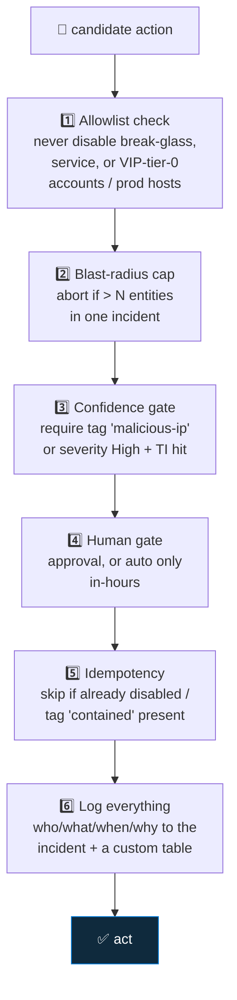

<div align="center">

# 🔄 Step 37 · Guardrails and conditions

### *Stop a playbook from doing damage at 3am*

[](../README.md)
[](#)
[](#)

</div>

---

## 🎯 Goal

Your response playbook (step 34) has explicit guardrails: an allowlist it will never touch, a
blast-radius cap, a business-hours / approval requirement, idempotency, and full logging.

## 🧠 Why this step

Automated response is a loaded gun. The failure mode isn't "it didn't run" — it's "it ran on the
wrong thing, at scale, fast". Guardrails are what let you actually enable it.

## ✅ Prerequisites

- [Step 34](../34-response-actions-with-approval/README.md) — you have a response playbook

## 🧭 The six guardrails



## 🖱️ Do it — add guardrails to `PB-Contain-User-Approval`

1. **Allowlist** — first action after Get Accounts:
   - **Run query** `_GetWatchlist('VIPUsers') | where Tier == "0" | project UserPrincipalName`
     plus a static list of break-glass/service accounts.
   - **Condition**: if the target UPN is in that list → **Add comment** "Blocked by allowlist:
     protected account" → **Terminate** (Succeeded).
2. **Blast-radius cap** — `length(body('Get_Accounts'))`:
   - **Condition**: `> 3` → comment "Blast radius 4+ accounts; escalating to on-call instead of
     auto-containing" → assign owner, tag `manual-review`, **Terminate**.
3. **Confidence gate** — condition on incident labels containing `malicious-ip` **OR** a TI match;
   else route to approval-only (no auto path).
4. **Business hours** — **Compose** `utcNow()` → convert to your TZ → if outside 08:00–20:00 Mon–Fri
   *and* no approval yet → force the approval branch (never silent auto at night).
5. **Idempotency** — before PATCH, **HTTP GET** the user; if `accountEnabled == false` or incident
   has tag `contained` → comment "already contained" → skip.
6. **Logging** — after every branch, **Logs Ingestion API** POST to `ResponseActions_CL`:
   `{ incident, action, target, decision, actor, timestamp, reason }`.

## 💻 Do it — the allowlist expression

```
@{if(
   contains(
     union(
       body('protected_static'),
       body('vip_tier0_query')?['value']
     ),
     items('For_each')?['Name']
   ),
   'BLOCKED', 'ALLOWED')}
```

## 🧪 Validate

Run these scenarios and confirm the playbook's decision each time (check `ResponseActions_CL`):

| Scenario | Expected |
|---|---|
| Incident targets `resp-test` (not protected), tagged `malicious-ip`, in hours, 1 account | Disabled after approval; logged `decision=disabled` |
| Incident targets a Tier-0 VIP | `decision=blocked-allowlist`, account untouched |
| Incident with 5 account entities | `decision=blast-radius-abort`, escalated |
| Same incident re-run after containment | `decision=skip-idempotent` |
| Out-of-hours, no approval | Forced to approval branch, no silent action |

```kusto
ResponseActions_CL
| where TimeGenerated > ago(1d)
| project TimeGenerated, incident_s, action_s, target_s, decision_s, reason_s
| sort by TimeGenerated desc
```

**You should see** every scenario produce the correct decision and a log row — especially the
*blocked* and *aborted* ones.

## 🚩 Common mistakes

| 🚩 Mistake | Why it bites |
|---|---|
| Allowlist checked *after* the disable action | Too late |
| No blast-radius cap | A rule misfire disables 50 users in 10 seconds |
| Guardrails but no logging | You can't prove what happened or why in the post-incident review |
| Business-hours logic in UTC assumed = local | Off-by-hours; convert explicitly |
| Idempotency ignored | Re-runs double-act or error confusingly |

## 🗒️ Log your run

`LOG.md` — the decision table above with real `ResponseActions_CL` rows (targets redacted).

## 📚 Microsoft Learn

- [Best practices for Microsoft Sentinel automation (SOAR)](https://learn.microsoft.com/en-us/azure/sentinel/automation/automation)
- [SOAR use cases](https://learn.microsoft.com/en-us/azure/sentinel/sentinel-soar-use-cases)
- [Approvals in Azure Logic Apps](https://learn.microsoft.com/en-us/azure/logic-apps/tutorial-process-mailing-list-subscriptions-workflow)

---

<div align="center">
<sub>

[⬅ Prev: 36 · Alert vs incident vs entity triggers](../36-alert-vs-incident-vs-entity-triggers/README.md) &nbsp;·&nbsp; [🦅 All steps](../README.md) &nbsp;·&nbsp; [Next: 38 · Playbooks as code ➡](../38-playbooks-as-code/README.md)

</sub>
</div>
