<div align="center">

# 🔄 Step 38 · Playbooks as code

### *Export a playbook to a clean, parameterised, secret-free template and redeploy it from scratch*

[](../README.md)
[](#)
[](#)

</div>

---

## 🎯 Goal

`PB-Notify-Incident` exists in this repo as an ARM template — **parameterised** (no hard-coded
workspace/connection IDs), **secret-free** (no callback URLs, no tokens), with a `metadata` block —
and you have **deployed it to a clean resource group** and confirmed it runs after a one-time OAuth
authorize.

## 🧠 Why this step

A playbook built only by clicking has the same four problems as a portal-only analytics rule
([step 28](../28-analytics-rules-as-code/README.md)): not reviewable, not recoverable, not
replicable, no history. It has one *extra* problem: the raw ARM export of a Logic App is **full of
things you must not commit** —

- **Callback URLs** (`https://prod-XX.<region>.logic.azure.com:443/workflows/<hex>/triggers/...?sig=<secret>`)
  — anyone with that URL can trigger your playbook.
- **`parameterValues` with tokens** from OAuth connections.
- **Environment IDs** — workspace GUID, tenant ID, subscription ID, connection resource IDs — that
  hard-wire it to one place.

So "playbook as code" is really "**how to export a playbook cleanly**". This step teaches that, and
proves it by round-tripping: export → scrub → parameterise → deploy to a fresh RG → it works.

What people get wrong: they commit the **raw** `Export template` output (secrets and all); they
leave **connection resource IDs** literal so it only deploys to the original RG; they forget that
**OAuth connections deploy unauthorized** and need a manual click; or they skip the
`parameters.sample.json` so nobody else can actually deploy it.

## ✅ Prerequisites

- [Step 30](../30-first-playbook-notify/README.md) — `PB-Notify-Incident` exists and runs.
- [Step 32](../32-playbook-managed-identity-and-permissions/README.md) — the Sentinel connection is
  on **managed identity** (MI connections carry no secret, so they deploy clean; Teams/Outlook stay
  OAuth and need a post-deploy authorize).
- `git`, the Azure CLI. Optionally the community
  [Sentinel Playbook ARM Template Generator](https://github.com/Azure/Azure-Sentinel/tree/master/Tools/Playbook-ARM-Template-Generator).

## 🧭 Concepts

```mermaid
flowchart LR
    PB["🖱️ PB-Notify-Incident (Logic App)"] -->|"export"| RAW["📄 raw ARM<br/>(literal IDs + callback URLs + tokens)"]
    RAW -->|"scrub + parameterise + add metadata"| CLEAN["📄 pb-notify-incident.json<br/>+ parameters.sample.json"]
    CLEAN -->|"az deployment group create"| NEW["▶️ Logic App in a fresh RG"]
    NEW -->|"one-time"| AUTH["🔑 authorize Teams/Outlook connections"]
    AUTH --> RUN["✅ fires on a test automation rule"]
    style CLEAN fill:#241a3a,stroke:#7b4fd0,color:#fff
    style RUN fill:#0f2a3d,stroke:#0078D4,color:#fff
```



### What's in a playbook ARM template

| Resource | Role | Deploy behaviour |
|---|---|---|
| `Microsoft.Logic/workflows` | The playbook: `parameters.$connections` + `definition` (triggers, actions) | Deploys fully from the template |
| `Microsoft.Web/connections` (one per connector) | Auth for `azuresentinel`, `teams`, `office365`, `keyvault`… | **MI** connections deploy connected; **OAuth** connections deploy *unauthorized* — a human clicks Authorize once |
| `Microsoft.OperationalInsights/.../providers/Microsoft.SecurityInsights/metadata` (optional) | Makes it show as a Sentinel playbook in Content hub | Optional |
| Parameters | `PlaybookName`, workspace name, connection names, region, Teams team/channel IDs | You supply per-environment |
| `identity` block | `type: SystemAssigned` | Recreates the MI (new principal ID → re-grant roles) |

### Never commit

- `accessEndpoint` / any `...logic.azure.com...?sig=` callback URL
- `parameterValues` containing `token`, `sig`, `accessKey`, a client secret
- Literal workspace GUID, tenant ID, subscription ID, connection resource IDs (parameterise them)

The repo's `.gitignore` blocks `*callback*`; the CI check ([`ci/structure-check.yml`](../ci/README.md))
greps for `logic.azure.com:443/workflows/[a-f0-9]{16,}`.

### How it works under the hood

- A Consumption playbook is a **single** `Microsoft.Logic/workflows` resource plus its
  `Microsoft.Web/connections`. (Standard Logic Apps package differently — `workflow.json` +
  `connections.json` + `host.json` in a bundle; this path is Consumption.)
- The workflow references connections via `parameters('$connections')` — the ARM param maps a
  connection *name* to its resource ID and `connectionProperties` (for MI, `authentication:
  { type: ManagedServiceIdentity }`).
- **MI connections** (`azuresentinel`, `azuremonitorlogs`, `keyvault` with MI) have no credential in
  the template — they just need the deploying MI to hold the right roles
  ([step 32](../32-playbook-managed-identity-and-permissions/README.md)).
- **OAuth connections** deploy with `properties.parameterValues` empty; the connection resource
  exists but shows *"Unauthorized"* until someone opens **API Connections → the connection → Edit →
  Authorize**.
- `az deployment group what-if` previews; the workflow `dependsOn` its connections.

### Vocabulary

| Term | Meaning |
|---|---|
| **Playbook as code** | A Logic App defined in a version-controlled ARM/Bicep file, deployed by tooling. |
| **Callback URL** | The secret HTTPS endpoint (`?sig=`) that can trigger a Logic App — never commit it. |
| **API connection** | `Microsoft.Web/connections` — auth for one connector; MI or OAuth. |
| **`$connections` parameter** | The ARM parameter mapping connection names to their resource IDs / auth. |
| **`parameters.sample.json`** | The example parameter file so others can deploy. |
| **`metadata` resource** | The optional resource that surfaces the playbook in Content hub. |
| **Playbook ARM Template Generator** | The community tool that produces a clean, parameterised template. |

### Where this fits

Companion to [step 28](../28-analytics-rules-as-code/README.md) (rules as code) and
[step 35](../35-automation-rules-triage/README.md) (automation rules as ARM).
[Step 55](../55-repositories-cicd/README.md) deploys the whole content set — rules + hunts +
automation rules + playbooks + workbooks — from Git.

### Design rationale

Logic Apps are ARM resources so the same deployment tooling manages them as the rest of Azure — but
the export includes trigger secrets by necessity, so a "clean export" step is unavoidable. The
community generator exists precisely because hand-scrubbing is error-prone.

## 🖱️ Do it — export cleanly

1. **Get a template.** Best: **Automation → Active playbooks → select `PB-Notify-Incident` →
   Export** (Sentinel's export is tuned for this), **or** run the
   [Playbook ARM Template Generator](https://github.com/Azure/Azure-Sentinel/tree/master/Tools/Playbook-ARM-Template-Generator)
   against it. Fallback: **Logic App → Export template** (rawest — most scrubbing).
2. **Scrub + parameterise** in the JSON:
   - Replace literal workspace ID / connection resource IDs with `parameters('...')`.
   - Delete every `parameterValues` block that holds a token or `sig`.
   - Remove any `accessEndpoint` / callback URL.
   - For OAuth connections, leave `parameterValues` empty (authorize post-deploy).
   - Add a `metadata` resource (`kind: Playbook`) so it shows in Content hub.
3. **Save** `artifacts/playbooks/pb-notify-incident.json` and a `parameters.sample.json`:

```json
{
  "$schema": "https://schema.management.azure.com/schemas/2019-04-01/deploymentParameters.json#",
  "contentVersion": "1.0.0.0",
  "parameters": {
    "PlaybookName": { "value": "PB-Notify-Incident" },
    "WorkspaceName": { "value": "law-sentinel-lab" },
    "TeamsTeamId": { "value": "<team-guid>" },
    "TeamsChannelId": { "value": "<channel-id>" }
  }
}
```

## 💻 Do it — deploy to a clean RG

```bash
az group create -n rg-sentinel-lab-deploytest -l eastus

az deployment group what-if -g rg-sentinel-lab-deploytest \
  --template-file artifacts/playbooks/pb-notify-incident.json \
  --parameters @artifacts/playbooks/parameters.sample.json \
  --parameters PlaybookName=PB-Notify-Incident-2

az deployment group create -g rg-sentinel-lab-deploytest \
  --template-file artifacts/playbooks/pb-notify-incident.json \
  --parameters @artifacts/playbooks/parameters.sample.json \
  --parameters PlaybookName=PB-Notify-Incident-2

# authorize the OAuth connections once:
#   Portal → rg-sentinel-lab-deploytest → API Connections → each Teams/Office365 connection
#   → Edit API connection → Authorize → Save
# re-grant the new MI its roles (system-assigned = a NEW principal id):
NEWLA=$(az resource show -g rg-sentinel-lab-deploytest -n PB-Notify-Incident-2 --resource-type Microsoft.Logic/workflows --query identity.principalId -o tsv)
az role assignment create --assignee-object-id "$NEWLA" --assignee-principal-type ServicePrincipal \
  --role "Microsoft Sentinel Responder" --scope "$(az group show -n rg-sentinel-lab --query id -o tsv)"
```

## 🧪 Validate

```bash
az resource show -g rg-sentinel-lab-deploytest -n PB-Notify-Incident-2 \
  --resource-type Microsoft.Logic/workflows \
  --query "{name:name, state:properties.state, mi:identity.type}" -o table

# API connections and their auth status
az resource list -g rg-sentinel-lab-deploytest --resource-type Microsoft.Web/connections \
  --query "[].{name:name, status:properties.statuses[0].status}" -o table
```

| Check | Healthy | Unhealthy |
|---|---|---|
| Workflow `state` | `Enabled` | `Disabled` / missing → deploy failed (read the deployment error) |
| MI connections (`azuresentinel`) | `Connected` | `Error` → MI missing roles on the new principal |
| OAuth connections (`teams`) | `Connected` **after** you authorize; `Unauthorized` before | still `Unauthorized` after authorizing → wrong account, re-do |
| Secret grep | `clean` | any hit → **do not commit** — scrub it |

```bash
grep -nE 'logic\.azure\.com|[?&]sig=|accessKey|"token"|[0-9a-f]{8}-[0-9a-f]{4}-[0-9a-f]{4}' \
  artifacts/playbooks/pb-notify-incident.json && echo "SCRUB THESE" || echo "clean"
```

Attach `PB-Notify-Incident-2` to a **test** automation rule, fire a `DET-IDENTITY-001` incident,
confirm the Teams message arrives and the run is **Succeeded**. Then **delete
`rg-sentinel-lab-deploytest`**.

**You should see** the playbook deploy from the template + `parameters.sample.json` alone, work
after a one-time OAuth authorize and a role re-grant, and the secret grep return `clean`. Commit
`artifacts/playbooks/`.

## 🚩 Common mistakes

| 🚩 Mistake | Why it bites |
|---|---|
| Committing the raw `Export template` output | Callback URLs = anyone can trigger your playbook |
| Literal connection / workspace resource IDs | Deploys only to the original RG/subscription |
| Expecting OAuth connections to work post-deploy | Teams/Outlook need a manual **Authorize** |
| Forgetting to re-grant the new MI its roles | System-assigned MI = a new principal on every fresh deploy |
| No `parameters.sample.json` | Nobody else can deploy it |
| No `metadata` block | It doesn't show as a Sentinel playbook in Content hub |
| Deploying Consumption template as if Standard (or vice versa) | Different packaging; the deploy fails or is incomplete |
| Editing the playbook in the portal *and* in the file | Drift — the deployed playbook no longer matches the template |

## 🩺 Troubleshooting

| Symptom | Likely cause | Fix |
|---|---|---|
| Deploy fails: connection not found | `$connections` param references a connection name/ID that doesn't exist in the target RG | Ensure the `Microsoft.Web/connections` resources are in the same template and `dependsOn`'d |
| Playbook deploys but every Sentinel action errors 403 | New MI has no roles | Re-grant Sentinel Responder / Log Analytics Reader to the new `principalId` ([step 32](../32-playbook-managed-identity-and-permissions/README.md)) |
| Teams connection stuck `Unauthorized` | Not authorized, or authorized as the wrong identity | API Connections → Edit → Authorize with the service account |
| `what-if` shows a full delete + recreate | Playbook name / resource id differs from the live one | Match `PlaybookName` to the existing resource to update in place |
| Secret grep hits a GUID that's fine (a Teams channel id) | Not all GUIDs are secrets | Confirm it's a channel/team id (public-ish), not a `sig`/token/subscription id; parameterise it anyway |
| Metadata resource deploy fails | Wrong scope or `parentId` | The `metadata` resource is scoped to the workspace; check the ARM reference |
| Redeploy wiped the MI role assignments | The `identity` block recreated the MI | In IaC, assign roles in the *same* deployment, `dependsOn` the workflow |

## 🎓 Deepen your understanding

1. Export `PB-Notify-Incident` three ways (Logic App export, Sentinel export, the community generator). Diff them. Which needs the least scrubbing, and what does each get wrong?
2. Your playbook uses a Key Vault connection on MI and a Teams connection on OAuth. After a fresh deploy, which one works immediately and which needs a human? Design the deploy runbook accordingly.
3. System-assigned MI means N playbooks = N principals = N sets of role assignments to maintain. Rewrite for a single **user-assigned** MI (Standard plan). What changes in the template, and what do you gain/lose?
4. Write the `parameters.dev.json` and `parameters.prod.json` for this playbook — what actually differs between environments (Teams channel, workspace, severity thresholds)?
5. A teammate edits the deployed playbook in the portal to fix a bug under pressure. How does your next `az deployment group create` behave, and how would [step 55](../55-repositories-cicd/README.md)'s pipeline catch the drift?

## 🗒️ Log your run

Copy [`_templates/STEP-LOG-TEMPLATE.md`](../_templates/STEP-LOG-TEMPLATE.md) into this folder as
`LOG.md`. Record: the export route used, the secret-grep result (`clean`), the deploy-to-fresh-RG
proof (workflow + connection statuses), the OAuth authorize step, and the MI role re-grant. Commit
`artifacts/playbooks/pb-notify-incident.json` + `parameters.sample.json`. Delete the test RG.

## 📚 Microsoft Learn

- [Export and deploy Microsoft Sentinel playbooks with ARM templates](https://learn.microsoft.com/en-us/azure/sentinel/use-playbook-templates)
- [Microsoft.Logic/workflows ARM template reference](https://learn.microsoft.com/en-us/azure/templates/microsoft.logic/workflows)
- [Create Logic Apps deployment templates](https://learn.microsoft.com/en-us/azure/logic-apps/logic-apps-azure-resource-manager-templates-overview)
- [Sentinel Playbook ARM Template Generator (community tool)](https://github.com/Azure/Azure-Sentinel/tree/master/Tools/Playbook-ARM-Template-Generator)
- [Deploy custom content from your repository (CI/CD)](https://learn.microsoft.com/en-us/azure/sentinel/ci-cd)

---

<div align="center">
<sub>

[⬅ Prev: 37 · Guardrails and conditions](../37-guardrails-and-conditions/README.md) &nbsp;·&nbsp; [🦅 All steps](../README.md) &nbsp;·&nbsp; [Next: 39 · Monitoring playbook runs & cost ➡](../39-monitoring-playbook-runs-and-cost/README.md)

</sub>
</div>
