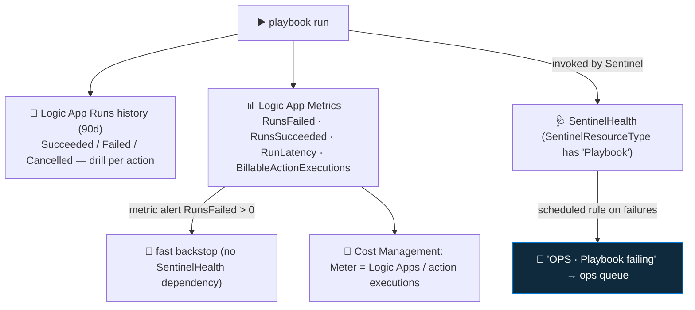

<div align="center">

# 🔄 Step 39 · Monitoring playbook runs & cost

### *A failing response playbook is a silent containment gap — and Logic Apps bill per action*

[](../README.md)
[](#)
[-107C10?style=flat-square)](#)

</div>

---

## 🎯 Goal

You have a per-playbook success-rate view, an **alert that fires when a playbook starts failing**
(routed to the ops queue, not security), a Logic App **metric alert** on `RunsFailed` as a
faster backstop, and a defensible **monthly automation cost** figure with the `For each` loops that
drive it identified.

## 🧠 Why this step

The automation phase built playbooks that **notify, enrich, and contain**. Two things now need
watching:

**Failures are invisible and dangerous.** If `PB-Contain-User-Approval` starts failing — the MI role
was removed, Graph changed a response shape, the approval connector broke — nobody gets disabled,
no error reaches an analyst, and the incident queue looks normal. It's the same silent-gap problem
as [step 15](../15-ingestion-health-and-validation/README.md) (data) and
[step 27](../27-rule-health-monitoring/README.md) (rules), one layer further out. A response
playbook that silently stopped working is arguably the worst of the three.

**Cost is real at scale.** Consumption Logic Apps bill **per action execution**. A 15-action
enrichment playbook with a `For each` over 8 IPs, running on 200 incidents/day, is
`200 × (15 + 8×3) ≈ 7,800` action executions/day. Individually tiny; at fleet scale it's a line
item, and a single noisy incident that fans out to 200 entities can spike it.

What people get wrong: **no failure alert** (find out during the next incident); **`For each` over
unbounded lists** (a scanning IP incident with 300 accounts × N inner actions); **ops alerts in the
security queue** (buries real incidents); or **blind retries** on a poisoned input that will never
succeed.

## ✅ Prerequisites

- [Step 15](../15-ingestion-health-and-validation/README.md) — `SentinelHealth` enabled (for the
  Sentinel-side view).
- [Step 27](../27-rule-health-monitoring/README.md) — you've built an ops-health rule before; same
  pattern.
- Several playbooks with real run history ([steps 30–37](../30-first-playbook-notify/README.md)).

## 🧭 Concepts



### Where run data lives

| Signal | Where | Notes |
|---|---|---|
| Per-run, per-action detail | Logic App → **Runs history** | Ground truth; 90-day retention (Consumption); drill into each action's inputs/outputs |
| Queryable run/action data | Logic App **diagnostic settings** → workspace → `AzureDiagnostics` (`ResourceProvider == "MICROSOFT.LOGIC"`) or the resource-specific runtime tables | Turn it on to query runs in KQL |
| Sentinel-invoked playbook health | `SentinelHealth` where `SentinelResourceType has "Playbook"` | Only for playbooks run **by Sentinel** (automation rule / automated response) |
| Automation-rule → playbook outcome | `SentinelHealth` `SentinelResourceType has "Automation"` | The rule's view of whether its playbook succeeded |
| Numeric health | Logic App → **Metrics** | `RunsFailed`, `RunsSucceeded`, `RunLatency`, `BillableActionExecutions`, `BillableTriggerExecutions` |
| Cost | **Cost Management** → filter Service = *Logic Apps*, group by Resource | Per-playbook spend |

### The cost model (Consumption)

- Billed **per execution**: the trigger, plus each **action** execution. A `For each` runs its
  inner actions once per item.
- Action types are priced differently — **built-in** (control, variables, Compose, HTTP) cheapest,
  **standard connectors** (Sentinel, Teams, Key Vault, Graph via HTTP) more, **enterprise**
  connectors most. There's a monthly free grant. **Check the current
  [Logic Apps pricing page](https://azure.microsoft.com/en-us/pricing/details/logic-apps/)** — the
  per-execution numbers change.
- **Standard** plan: a fixed monthly hosting cost (~hundreds of USD) + per-execution. Worth it only
  at high sustained volume, or when you need VNet integration / stateful workflows.
- The lever: bound your `For each` loops (cap N entities), set **concurrency** on the loop, and
  don't loop a per-item HTTP call you could do as one batched call.

### Vocabulary

| Term | Meaning |
|---|---|
| **Run** | One execution of a playbook (one trigger firing). |
| **Action execution** | One step running — the unit Consumption Logic Apps bill on. |
| **`RunsFailed` metric** | Azure Monitor metric counting failed runs — alertable directly, no SentinelHealth. |
| **Metric alert** | An Azure Monitor alert on a resource metric threshold. |
| **Concurrency control** | A `For each` setting limiting how many iterations run in parallel. |
| **Poisoned input** | An input that will never succeed (bad IP, deleted user) — retries waste executions. |

### Where this fits

Completes the automation phase's operational side. It reuses the ops-rule pattern from
[step 27](../27-rule-health-monitoring/README.md), routes away from the analyst queue like
[step 35](../35-automation-rules-triage/README.md), and the cost view feeds
[step 56](../56-cost-engineering/README.md). The `ResponseActions_CL` log from
[step 37](../37-guardrails-and-conditions/README.md) tells you whether automation did the *right*
thing; this step tells you whether it *ran*.

### Design rationale

Sentinel surfaces playbook health in `SentinelHealth` only for playbooks it invokes; the Logic App's
own metrics and run history cover the rest. Using a metric alert on `RunsFailed` as the fast path
(and the SentinelHealth scheduled rule as the detailed path) gives you speed *and* context.

## 🖱️ Do it — portal

1. **Read the failures.** Each playbook → **Runs history** → filter **Failed** → open one → find the
   red action → read its **Outputs** for the error.
2. **Turn on queryable run logs.** Each playbook → **Diagnostic settings → + Add** → category
   **WorkflowRuntime** → destination `law-sentinel-lab` → Save.
3. **Metric alert (fast backstop).** Each response playbook → **Alerts → + Create → Alert rule** →
   signal **Runs Failed** → condition *Greater than 0* over 15 min → action group = your ops
   email/on-call. (One alert rule can target multiple Logic Apps.)
4. **Cost view.** Cost Management → **Cost analysis** → scope `rg-sentinel-lab` → filter **Service
   name = Logic Apps** → group by **Resource** → save as `automation-cost`.
5. **Workbook.** Monitor → Workbooks → save **"Playbooks health monitoring"** / **"Automation
   health"** if your Content hub has it.

## 💻 Do it — KQL / IaC

```kusto
// playbook success rate, 7 days (Sentinel-invoked)
SentinelHealth
| where TimeGenerated > ago(7d) and SentinelResourceType has "Playbook"
| summarize Runs = count(), Failures = countif(Status != "Success") by Playbook = SentinelResourceName
| extend FailPct = round(100.0 * Failures / Runs, 1)
| sort by FailPct desc
```

```kusto
// recent failures + reason
SentinelHealth
| where TimeGenerated > ago(2d) and SentinelResourceType has "Playbook" and Status != "Success"
| project TimeGenerated, Playbook = SentinelResourceName, Status,
          Reason = coalesce(tostring(ExtendedProperties.Error), Description)
| sort by TimeGenerated desc
```

```kusto
// automation rules that failed to run their playbook
SentinelHealth
| where TimeGenerated > ago(2d) and SentinelResourceType has "Automation" and Status != "Success"
| project TimeGenerated, Rule = SentinelResourceName, Description
```

```kusto
// action-level detail once WorkflowRuntime diagnostics are on
AzureDiagnostics
| where TimeGenerated > ago(1d) and ResourceProvider == "MICROSOFT.LOGIC"
| where status_s == "Failed"
| project TimeGenerated, workflowName_s, resource_actionName_s, error_message_s
```

**Build `OPS · Playbook failing`:** a scheduled rule (every 1h, lookback 2h) on the failures query,
threshold > 0, severity Medium, custom detail `Playbook`. Automated response → an automation rule
that tags `ops-health` and assigns to **ops** — **not** the security queue.

## 🧪 Validate

1. **Break a playbook**: revoke its MI's Sentinel Responder role (or point one HTTP action at a
   `https://httpstat.us/500`). Fire an incident so it runs.
2. Confirm the loop:

| Stage | Expected |
|---|---|
| Runs history | the run shows **Failed**, the broken action red |
| Metric alert | `RunsFailed > 0` fires within ~15 min → ops notified |
| `SentinelHealth` failures query | returns the playbook + a readable reason |
| `OPS · Playbook failing` rule | raises an incident, `Playbook` custom detail set, tagged `ops-health` |
| Routing | ops incident **not** in the security analyst queue |
| Fix it | re-grant the role / fix the URL → next run **Succeeded**; ops incident closes and stays closed |

3. **Cost estimate.** Count actions in your busiest playbook (include `For each` × items). Estimate
   `runs/day × action_executions/run × $per_execution` from the pricing page. Then compare to
   **Cost Management → automation-cost** after a day.

**You should see** the failure caught by *your* alerting (not luck), routed to ops, and a defensible
monthly automation cost with the `For each` loops that dominate it named.

## 🚩 Common mistakes

| 🚩 Mistake | Why it bites |
|---|---|
| No alert on playbook failure | Containment silently stops working; you find out during an incident |
| Relying only on `SentinelHealth` | It only covers Sentinel-invoked runs; use the Logic App metric too |
| `For each` over unbounded entity lists | Action count, cost, and rate limits explode on a noisy incident |
| Ops-health alerts in the security queue | They bury real incidents |
| Blind retries on a poisoned input | A bad IP that always 400s retries and wastes executions |
| No diagnostic settings on the Logic Apps | You can't query run/action failures in KQL |
| Ignoring `RunLatency` | An enrichment playbook that got slow delays every incident's context |
| Standard plan for a low-volume lab | Hundreds of USD/month for something Consumption does for cents |

## 🩺 Troubleshooting

| Symptom | Likely cause | Fix |
|---|---|---|
| `SentinelHealth` has no playbook rows | Health monitoring off, or the playbook wasn't invoked by Sentinel | Enable health monitoring ([step 15](../15-ingestion-health-and-validation/README.md)); check the Logic App metrics instead |
| Metric alert never fires despite failures | Wrong metric (`ActionsFailed` vs `RunsFailed`), or aggregation window too long | Use **Runs Failed**, *Total*, 5–15 min window |
| `AzureDiagnostics` empty for the Logic App | Diagnostic settings not added, or wrong category | Add **WorkflowRuntime** category → workspace |
| Runs history shows Failed but no obvious action error | The trigger failed (permissions), or a `Terminate` with Failed status | Expand the trigger; check `Terminate` actions in the definition |
| Cost higher than your estimate | A `For each` fanned out on a big incident, or you're on Standard plan | Check `BillableActionExecutions` per playbook per day; cap the loop; verify the plan |
| Playbook "succeeds" but did nothing | A guardrail terminated it as Succeeded ([step 37](../37-guardrails-and-conditions/README.md)) | That's by design — check `ResponseActions_CL` for the decision |
| Ops rule fires for a playbook that's actually fine | Transient single failure (one 429) | Set the threshold to > 1 failure in the window, or exclude playbooks with a known-flaky external dependency |

## 🎓 Deepen your understanding

1. `SentinelHealth` vs the Logic App `RunsFailed` metric vs Runs history — which is fastest, which is most detailed, which covers manual/entity-triggered runs? Which one does your `OPS · Playbook failing` rule use, and should it use both?
2. Count the action executions for one full `PB-Contain-User-Approval` run through the guardrail chain (step 37). Now the same with a 5-account incident. Where's the cost, and what would you cap?
3. A playbook's HTTP action to a reputation API starts returning 500. Default retry is 4× exponential. How many wasted executions per incident, and what's the better failure handling?
4. `RunLatency` for `PB-Enrich-IP-Reputation` climbs from 8s to 90s (the API got slow). What downstream effect does that have, and how would you alert on it before an analyst complains?
5. You're deciding Consumption vs Standard for a SOC running ~2,000 incidents/day with heavy automation. Sketch the cost comparison and the non-cost reasons (VNet, throughput, cold-start) that might tip it.

## 🗒️ Log your run

Copy [`_templates/STEP-LOG-TEMPLATE.md`](../_templates/STEP-LOG-TEMPLATE.md) into this folder as
`LOG.md`. Record: the success-rate table, evidence the failure alert (metric **and** the ops rule)
fired and routed to ops, your automation **cost estimate vs the Cost Management actual**, and the
`For each` loops you identified as cost drivers.

## 📚 Microsoft Learn

- [Monitor the health and audit the integrity of your automation](https://learn.microsoft.com/en-us/azure/sentinel/monitor-automation-health)
- [Monitor run status, review trigger history, and set up alerts for Azure Logic Apps](https://learn.microsoft.com/en-us/azure/logic-apps/monitor-logic-apps)
- [Set up Azure Monitor logs and collect diagnostics data for Azure Logic Apps](https://learn.microsoft.com/en-us/azure/logic-apps/monitor-workflows-collect-diagnostic-data)
- [Azure Logic Apps pricing](https://azure.microsoft.com/en-us/pricing/details/logic-apps/)
- [Consumption vs Standard Logic Apps](https://learn.microsoft.com/en-us/azure/logic-apps/single-tenant-overview-compare)

---

<div align="center">
<sub>

[⬅ Prev: 38 · Playbooks as code](../38-playbooks-as-code/README.md) &nbsp;·&nbsp; [🦅 All steps](../README.md) &nbsp;·&nbsp; [Next: 40 · Hunting mindset & hypotheses ➡](../40-hunting-mindset-and-hypotheses/README.md)

</sub>
</div>
