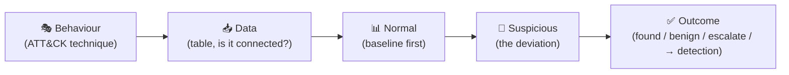

<div align="center">

# 🏹 Step 40 · Hunting mindset & hypotheses

### *Write a hunt you can actually prove or disprove*

[](../README.md)
[](#)
[](#)

</div>

---

## 🎯 Goal

You've written three hunt hypotheses in the `HUNT-*` template format — testable, falsifiable, and
mapped to data you actually have.

## 🧠 Why this step

Hunting is not "run random queries and see". It's a hypothesis-driven search for activity that
**evaded your detections**. A good hypothesis names an adversary behaviour, the data that would show
it, what "normal" looks like, and what would be suspicious.

## ✅ Prerequisites

- [Step 25](../25-mitre-attack-coverage/README.md) — you have a coverage-gap list
- Data from phase 📥

## 🧭 The anatomy of a hunt hypothesis



Template sentence:

> *"If **\<behaviour\>** is happening in this environment, I would expect to see **\<observable\>**
> in **\<table\>**, which is unusual because **\<baseline\>**."*

**Good** (testable): *"If an attacker is using a compromised service account for lateral movement,
I'd expect `SecurityEvent` 4624 LogonType 3 from that account to hosts it has never authenticated to
before, which is unusual because service accounts normally touch a fixed small set of hosts."*

**Bad** (not testable): *"Check for suspicious PowerShell."*

## 🖱️ Do it — write three, from your gap list

Pick three tactics you flagged blank in step 25. For each, copy
[`_templates/HUNT-TEMPLATE.md`](../_templates/HUNT-TEMPLATE.md) into
`artifacts/HUNT-<DOMAIN>-00X.md` and fill:

- **Hypothesis** — the sentence above.
- **MITRE** — tactic + technique ID.
- **Data needed** — exact tables, and tick whether each is actually connected (check step 15's
  board). If not connected, that's a finding in itself: "we cannot hunt this — connector gap".
- **What normal looks like** — write the baseline query first.
- **What would be suspicious** — the deviation.

Example set:
1. `HUNT-IDENTITY-001` — OAuth consent to an app with broad Graph scopes by a non-admin.
2. `HUNT-ENDPOINT-001` — `regsvr32` / `rundll32` with a network-loaded argument (LOLBin).
3. `HUNT-EXFIL-001` — a host sending far more bytes to a rare external ASN than its 30-day norm.

## 🧪 Validate

For each hypothesis, run **only the baseline query** in Logs and confirm you can describe "normal"
in one sentence backed by numbers. Example:

```kusto
// baseline for HUNT-ENDPOINT-001
DeviceProcessEvents
| where TimeGenerated > ago(30d)
| where FileName in~ ("regsvr32.exe","rundll32.exe","mshta.exe")
| summarize Runs = count(), Hosts = dcount(DeviceName), CmdSamples = make_set(ProcessCommandLine, 5)
```

**You should see**, for each hunt: a written hypothesis, a confirmed data-availability status, and a
one-sentence baseline with numbers. If a hunt's data isn't connected, log it as a connector gap and
pick another.

## 🚩 Common mistakes

| 🚩 Mistake | Why it bites |
|---|---|
| Hypothesis with no falsification condition | You can "hunt" forever and never conclude |
| Skipping the baseline | Every result looks scary without "normal" to compare to |
| Hunting data you haven't connected | Empty results ≠ "clean" |
| Re-hunting what a rule already catches | Hunt the *gaps*, not the covered techniques |

## 🗒️ Log your run

`LOG.md` + the three `HUNT-*.md` files in `artifacts/`.

## 📚 Microsoft Learn

- [Threat hunting in Microsoft Sentinel](https://learn.microsoft.com/en-us/azure/sentinel/hunting)
- [Conduct end-to-end proactive threat hunting](https://learn.microsoft.com/en-us/azure/sentinel/hunts)
- [MITRE ATT&CK — how to think about adversary behaviour](https://attack.mitre.org/resources/getting-started/)

---

<div align="center">
<sub>

[⬅ Prev: 39 · Monitoring playbook runs & cost](../39-monitoring-playbook-runs-and-cost/README.md) &nbsp;·&nbsp; [🦅 All steps](../README.md) &nbsp;·&nbsp; [Next: 41 · The Hunting blade ➡](../41-the-hunting-blade/README.md)

</sub>
</div>
