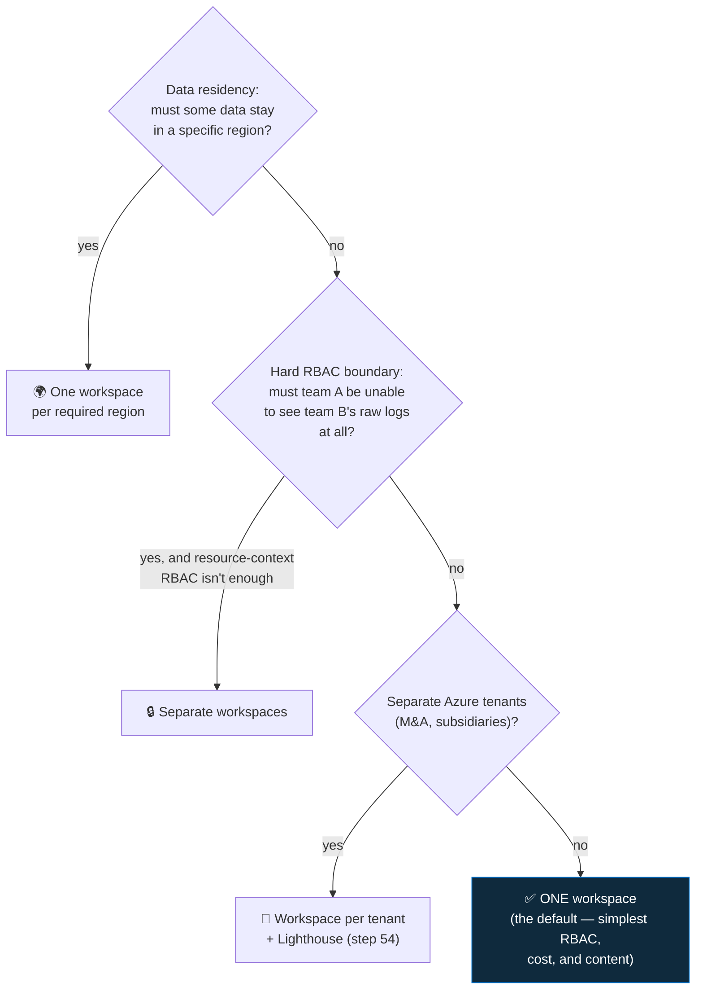

<div align="center">

# 🛰️ Step 53 · Workspace architecture

### *One workspace or many — decide it with reasons, not vibes*

[](../README.md)
[](#)
[](#)

</div>

---

## 🎯 Goal

You've written a one-page workspace design decision for a hypothetical org, with the trade-offs
named, and you can query across workspaces.

## 🧠 Why this step

Workspace layout is the hardest thing to change later — it's tied to data residency, RBAC
boundaries, cost, and every rule/workbook you write. Most orgs should use **one workspace**; the
exceptions are specific and worth knowing.

## ✅ Prerequisites

- [Step 01](../01-log-analytics-workspace/README.md), [16](../16-retention-archive-and-data-lake/README.md)

## 🧭 The decision



| Factor | One workspace | Multiple workspaces |
|---|---|---|
| RBAC | Table-level + resource-context RBAC | Hard isolation, but N× to manage |
| Cost | Simplest; one commitment tier | Each below its own tier discount; cross-workspace query has egress |
| Content (rules/workbooks) | Write once | Duplicate or use `workspace()` / cross-workspace rules (limits apply) |
| Data residency | Single region | Region per workspace |
| Incidents | One queue | Fragmented unless unified (step 52) |

**Cross-workspace query:**

```kusto
union
  workspace("law-sentinel-lab").SigninLogs,
  workspace("/subscriptions/<sub>/resourceGroups/<rg>/providers/Microsoft.OperationalInsights/workspaces/law-eu").SigninLogs
| where TimeGenerated > ago(1h) and ResultType != 0
| summarize count() by _ResourceId, UserPrincipalName
```

Cross-workspace **analytics rules** are supported but capped (currently ~20 workspaces per rule) and
slower — prefer consolidating.

## 🖱️ Do it — write the decision

Create `artifacts/workspace-design.md` for this scenario:

> *A retailer, HQ in Germany, stores in 6 EU countries, one AWS footprint, a recently acquired UK
> subsidiary on a separate tenant. ~40 GB/day total. SOC is one central team.*

Answer: how many workspaces, in which regions, why, how RBAC works, how the UK sub is handled, and
what it costs vs the alternative. Use the flowchart. There's a defensible answer (likely: one EU
workspace + Lighthouse onboarding of the UK sub's own workspace, unified in the Defender portal).

## 🧪 Validate

- Your design names **data residency**, **RBAC**, **cost**, **content management** and **incident
  queue** as the five axes, and picks each deliberately.
- You can run a cross-workspace `union` query (even against just your one workspace by its full
  resource ID).
- You can state why resource-context RBAC (`enableLogAccessUsingOnlyResourcePermissions`, set in
  step 01) often removes the need for separate workspaces.

**You should see** a one-pager that a real architect could disagree with *on the merits* — not a
hand-wave.

## 🚩 Common mistakes

| 🚩 Mistake | Why it bites |
|---|---|
| A workspace per team "for tidiness" | N× content, fragmented incidents, lost tier discounts |
| A workspace per subscription | Same |
| Assuming you can merge workspaces later | You can't — it's a migration (step 60 techniques) |
| Ignoring resource-context RBAC | It solves most "team A shouldn't see team B" cases without splitting |

## 🗒️ Log your run

`LOG.md` + `artifacts/workspace-design.md`.

## 📚 Microsoft Learn

- [Design a Microsoft Sentinel workspace architecture](https://learn.microsoft.com/en-us/azure/sentinel/design-your-workspace-architecture)
- [Workspace architecture best practices](https://learn.microsoft.com/en-us/azure/sentinel/best-practices-workspace-architecture)
- [Extend Microsoft Sentinel across workspaces and tenants](https://learn.microsoft.com/en-us/azure/sentinel/extend-sentinel-across-workspaces-tenants)

---

<div align="center">
<sub>

[⬅ Prev: 52 · Unified SecOps (Defender portal)](../52-unified-secops-defender-portal/README.md) &nbsp;·&nbsp; [🦅 All steps](../README.md) &nbsp;·&nbsp; [Next: 54 · Multi-tenant & Lighthouse ➡](../54-multi-tenant-and-lighthouse/README.md)

</sub>
</div>
