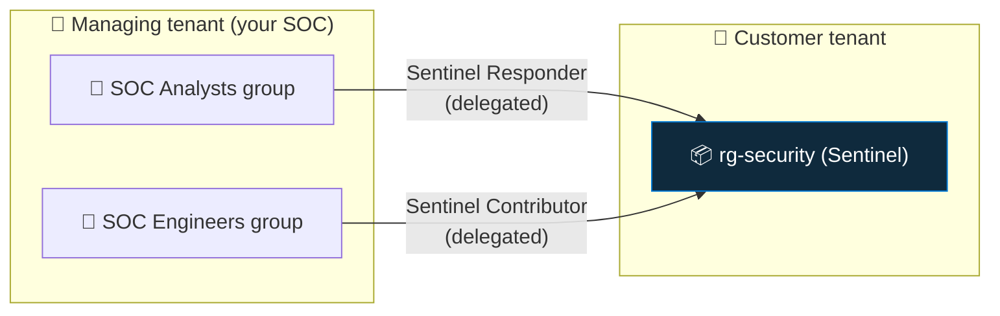

<div align="center">

# 🛰️ Step 54 · Multi-tenant & Azure Lighthouse

### *The MSSP / multi-subsidiary SOC model*

[](../README.md)
[](#)
[-107C10?style=flat-square)](#)

</div>

---

## 🎯 Goal

You understand how a SOC in one tenant operates Sentinel in customer/subsidiary tenants via Azure
Lighthouse, and (if you have a second tenant) you've delegated a resource group and queried it.

## 🧠 Why this step

MSSPs and enterprises with multiple tenants run one SOC across many Sentinels. Azure Lighthouse
delegates scoped access from a customer tenant to your managing tenant — no guest accounts, no
tenant switching, least privilege, fully audited.

## ✅ Prerequisites

- Conceptual: none. Hands-on: a **second Entra tenant** with its own subscription + Sentinel
- In the managing tenant: a group to receive the delegated roles

## 🧭 How it fits together



- Delegation is defined in an **ARM template** (`registrationDefinition` +
  `registrationAssignment`) deployed **in the customer tenant**.
- You grant **your managing-tenant principals** specific built-in roles at a **subscription or RG
  scope** in the customer.
- After that, your analysts see the customer's Sentinel under **My customers** / in the same
  Incidents view — no account in the customer tenant.
- Cross-tenant hunting: `workspace()` with the customer workspace's full resource ID.

## 🖱️ Do it — delegate (run in the CUSTOMER tenant)

`artifacts/lighthouse/delegation.json` (key properties):

```json
{
  "properties": {
    "registrationDefinitionName": "SOC - Sentinel operations",
    "managedByTenantId": "<YOUR-MANAGING-TENANT-ID>",
    "authorizations": [
      { "principalId": "<SOC-Analysts-group-objectId>", "principalIdDisplayName": "SOC Analysts",
        "roleDefinitionId": "8d289c81-5878-46d4-8554-54e1e3d8b5cb" },   // Microsoft Sentinel Responder
      { "principalId": "<SOC-Engineers-group-objectId>", "principalIdDisplayName": "SOC Engineers",
        "roleDefinitionId": "ab8e14d6-4a74-4a29-9ba8-549422addade" }    // Microsoft Sentinel Contributor
    ]
  }
}
```

```bash
# customer-tenant admin runs this at the target subscription/RG scope
az deployment group create -g rg-security \
  --template-file artifacts/lighthouse/delegation.json
```

## 🧪 Validate

From the **managing tenant**:

```bash
az account list --query "[?homeTenantId != tenantId].{name:name, tenant:homeTenantId}" -o table
# the delegated customer subscription shows up here

WS="/subscriptions/<customer-sub>/resourceGroups/rg-security/providers/Microsoft.OperationalInsights/workspaces/<customer-ws>"
az monitor log-analytics query --workspace <customer-ws-guid> \
  --analytics-query "SigninLogs | summarize count() by ResultType | take 5"
```

Cross-tenant hunt:

```kusto
union
  SigninLogs,
  workspace("<customer-ws-resource-id>").SigninLogs
| where TimeGenerated > ago(1h) and ResultType != 0
| summarize Failures = count() by _ResourceId, UserPrincipalName
```

**You should see** the customer subscription listed in `az account list` from your SOC tenant, a
query returning the customer's data, and — in the portal — the customer's Sentinel incidents
without switching directories.

## 🚩 Common mistakes

| 🚩 Mistake | Why it bites |
|---|---|
| Delegating `Owner` / broad roles | Lighthouse is for least privilege — use the Sentinel roles |
| Guest accounts instead of Lighthouse | Weaker isolation, tenant-switching, harder to audit |
| Forgetting Lighthouse can't grant Entra roles | Directory-level actions (disable user) need a different mechanism per tenant |
| No `managed by` visibility for the customer | Customers can see and revoke delegations — that's a feature, communicate it |

## 🗒️ Log your run

`LOG.md` + `artifacts/lighthouse/delegation.json` (IDs redacted). If you only did the conceptual
path, write the delegation design for the step-53 UK-subsidiary scenario.

## 📚 Microsoft Learn

- [Manage Microsoft Sentinel across tenants with Azure Lighthouse](https://learn.microsoft.com/en-us/azure/sentinel/multiple-tenants-service-providers)
- [Azure Lighthouse overview](https://learn.microsoft.com/en-us/azure/lighthouse/overview)
- [Cross-workspace and cross-tenant queries](https://learn.microsoft.com/en-us/azure/sentinel/extend-sentinel-across-workspaces-tenants)

---

<div align="center">
<sub>

[⬅ Prev: 53 · Workspace architecture](../53-workspace-architecture/README.md) &nbsp;·&nbsp; [🦅 All steps](../README.md) &nbsp;·&nbsp; [Next: 55 · Repositories & CI/CD ➡](../55-repositories-cicd/README.md)

</sub>
</div>
