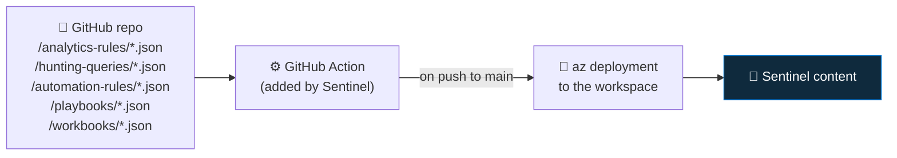

<div align="center">

# 🛰️ Step 55 · Repositories & CI/CD

### *Deploy all Sentinel content from Git*

[](../README.md)
[](#)
[-107C10?style=flat-square)](#)

</div>

---

## 🎯 Goal

A Git repo connected to Sentinel via the **Repositories** feature, so a push deploys your analytics
rules, hunting queries, automation rules, playbooks and workbooks to the workspace.

## 🧠 Why this step

Everything you've built as `artifacts/` should be the *source of truth*, and the workspace should be
a *deployment target*. The Repositories feature gives you that with a Microsoft-maintained
GitHub/Azure DevOps pipeline — no hand-rolled deploy scripts.

## ✅ Prerequisites

- Steps 28 & 38 — you have rules and a playbook as ARM/Bicep
- A GitHub repo (this one, or a dedicated `sentinel-content` repo) and **Owner** on the workspace
  resource group (Repositories creates an app registration + role assignment)

## 🧭 How Repositories works



- Sentinel adds a **workflow file** + a **service principal** with the right RBAC.
- A `sentinel-deployment.config` file at repo root controls which folders/paths deploy and what to
  exclude.
- Content is expected as **ARM templates** (the exports from steps 28/38). Bicep works if compiled.

## 🖱️ Do it

1. Structure the repo:

```
sentinel-content/
├── sentinel-deployment.config
├── analytics-rules/
│   ├── det-identity-001.json
│   └── det-exfil-001.json
├── hunting-queries/
│   └── hunt-endpoint-001.json
├── automation-rules/
│   └── ar-suppress-scanner.json
├── playbooks/
│   └── pb-notify-incident.json
└── workbooks/
```

2. `sentinel-deployment.config`:

```json
{
  "version": "3.0.0",
  "prioritizedContentFiles": [ "analytics-rules/", "automation-rules/" ],
  "excludeContentFiles": [ "playbooks/pb-*-draft.json", "**/*.sample.json" ],
  "parameterFileMappings": {
    "<workspace-subscription-id>": { "analytics-rules/det-identity-001.json": "analytics-rules/det-identity-001.parameters.json" }
  }
}
```

3. **Microsoft Sentinel → Repositories → Connect repository** → GitHub → authorise → pick the repo
   and branch `main` → content types to deploy → **Connect**.
4. It commits a `.github/workflows/sentinel-deploy-*.yml` to your repo.
5. Push a change to an analytics rule JSON → watch the Action run → **Repositories** blade shows the
   deployment result.

## 💻 Do it — inspect the generated workflow

```yaml
# .github/workflows/sentinel-deploy-<guid>.yml  (added by Sentinel)
on:
  push:
    branches: [ main ]
    paths: [ '**.json', 'sentinel-deployment.config' ]
jobs:
  deploy-content:
    runs-on: ubuntu-latest
    steps:
      - uses: actions/checkout@v3
      - uses: Azure/sentinel-github-action@v3
        with:
          workspaceId: ${{ secrets.WORKSPACE_ID }}
          # OIDC federated creds — no stored secret
```

## 🧪 Validate

1. Change the severity of `det-identity-001.json` in Git, commit, push.
2. GitHub Actions run goes green.
3. **Repositories** blade → last deployment **Success**, lists the rule.
4. **Analytics** → the rule's severity changed to match the repo.
5. Break the JSON (invalid `queryFrequency`), push → the Action **fails** and the workspace is
   **unchanged** — the pipeline is your guardrail.

```bash
az sentinel alert-rule show -g rg-sentinel-lab --workspace-name law-sentinel-lab \
  --rule-id <id> --query "{name:displayName, sev:severity}" -o table
```

**You should see** a push change the live rule, and a bad push get rejected without touching the
workspace.

## 🚩 Common mistakes

| 🚩 Mistake | Why it bites |
|---|---|
| Editing rules in the portal after connecting a repo | Next deploy overwrites your portal change — repo is now the source of truth |
| Committing playbook exports with callback URLs | Secret leak — the `structure.yml` grep catches it; keep it |
| No `parameterFileMappings` for multi-workspace | Same rule can't target dev + prod |
| Deploying everything on every push | Scope `paths:` and use `prioritizedContentFiles` |

## 🗒️ Log your run

`LOG.md` — the connect step, a successful deploy, and the rejected bad push. Commit the content repo
structure to `artifacts/`.

## 📚 Microsoft Learn

- [Deploy custom content from your repository](https://learn.microsoft.com/en-us/azure/sentinel/ci-cd)
- [Sentinel Repositories: deployment config](https://learn.microsoft.com/en-us/azure/sentinel/ci-cd-custom-content)
- [Azure/Azure-Sentinel GitHub — content structure](https://github.com/Azure/Azure-Sentinel)

---

<div align="center">
<sub>

[⬅ Prev: 54 · Multi-tenant & Lighthouse](../54-multi-tenant-and-lighthouse/README.md) &nbsp;·&nbsp; [🦅 All steps](../README.md) &nbsp;·&nbsp; [Next: 56 · Cost engineering ➡](../56-cost-engineering/README.md)

</sub>
</div>
