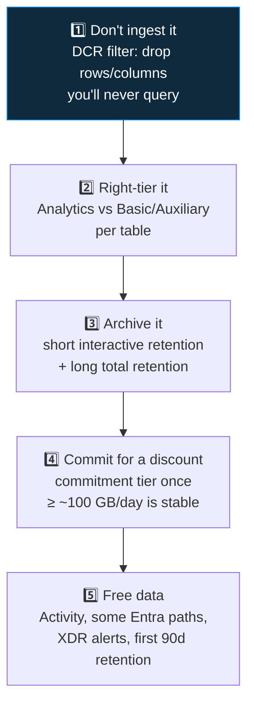

<div align="center">

# 🛰️ Step 56 · Cost engineering

### *Commitment tiers, basic logs, and dropping noise before you pay for it*

[](../README.md)
[](#)
[](#)

</div>

---

## 🎯 Goal

You've produced a costed reduction plan for your workspace: what to move to Basic/Aux, what to drop
at ingest, whether a commitment tier pays off, and the projected monthly saving.

## 🧠 Why this step

At scale, Sentinel cost is a real budget line and a real skill. The levers compound: filter at
ingest, tier by value, commit for a discount, archive cheaply.

## ✅ Prerequisites

- [Step 06](../06-cost-model-and-budget/README.md), [13](../13-custom-logs-and-dcr-transformations/README.md), [16](../16-retention-archive-and-data-lake/README.md)
- A few weeks of real ingest data (or model it)

## 🧭 The levers, in priority order



## 💻 Do it — the analysis queries

```kusto
// 1. biggest tables by billable GB / month
Usage
| where TimeGenerated > ago(30d) and IsBillable == true
| summarize GB = sum(Quantity)/1000 by DataType
| extend MonthlyUSD_Analytics = GB * 2.30
| sort by GB desc
```

```kusto
// 2. which SecurityEvent EventIDs actually get used by rules/hunts vs just sit there
SecurityEvent
| where TimeGenerated > ago(30d)
| summarize GB = sum(_BilledSize)/1e9, Events = count() by EventID
| sort by GB desc
// cross-reference against the EventIDs your rules query -> the rest are DCR-filter candidates
```

```kusto
// 3. columns you could project away in a DCR transform (wide, low-value)
CommonSecurityLog
| where TimeGenerated > ago(7d)
| take 1000
| project-keep *
// eyeball for AdditionalExtensions, DeviceCustomString*, unused fields
```

```kusto
// 4. commitment tier break-even
Usage
| where TimeGenerated > ago(30d) and IsBillable
| summarize GBperDay = sum(Quantity)/1000/30
// compare GBperDay to the tier table: 100/200/300/400/500/1000/2000/5000 GB/day
```

## 🖱️ Do it — apply one of each

1. **DCR filter** — add a `transformKql` to your busiest DCR that drops the noisiest EventID or
   `where`-filters an obviously benign facility (step 13 mechanics).
2. **Basic tier** — move one high-volume, rules-don't-need-it table (step 16).
3. **Commitment tier** — *only if* your stable GB/day clears a tier: **Settings → Usage and
   estimated costs → Change pricing tier**. In the lab, just document the break-even.
4. **Verify free sources** — confirm `AzureActivity` and XDR alert ingestion show
   `IsBillable == false` / near-zero in `Usage`.

## 🧪 Validate

Produce `artifacts/cost-reduction-plan.md`:

| Action | Current GB/mo | After | Monthly $ saved | Trade-off |
|---|---|---|---|---|
| DCR-drop EventID 5379/4662 noise | … | … | … | lose those events from hunts |
| CommonSecurityLog → Basic | … | … | … | no scheduled rules on it |
| 90d interactive → 30d + archive | … | … | … | older queries need a search job |
| Commitment tier 100 GB/day | … | … | … | pay for 100 even on a light day |

**You should see** a defensible total saving with each trade-off stated, and at least one lever
actually applied in the lab with a before/after `Usage` number.

## 🚩 Common mistakes

| 🚩 Mistake | Why it bites |
|---|---|
| Commitment tier before volume is stable | You pay for capacity you don't use |
| Basic-tiering a table a rule depends on | The rule silently can't run |
| Filtering data a future investigation needs | Cheap now, blind later — send it to Aux, don't drop it |
| Optimising tiny tables | Effort with no payoff — go after the top 3 by GB |

## 🗒️ Log your run

`LOG.md` + `artifacts/cost-reduction-plan.md` + the one lever's before/after.

## 📚 Microsoft Learn

- [Reduce costs for Microsoft Sentinel](https://learn.microsoft.com/en-us/azure/sentinel/billing-reduce-costs)
- [Microsoft Sentinel pricing — commitment tiers](https://azure.microsoft.com/en-us/pricing/details/microsoft-sentinel/)
- [Manage usage and costs with Log Analytics](https://learn.microsoft.com/en-us/azure/azure-monitor/logs/cost-logs)

---

<div align="center">
<sub>

[⬅ Prev: 55 · Repositories & CI/CD](../55-repositories-cicd/README.md) &nbsp;·&nbsp; [🦅 All steps](../README.md) &nbsp;·&nbsp; [Next: 57 · SOC optimization & coverage ➡](../57-soc-optimization-and-coverage/README.md)

</sub>
</div>
