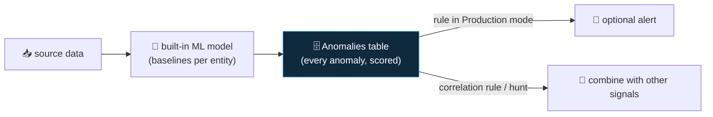

<div align="center">

# 🛰️ Step 59 · Anomaly & ML rules

### *Customize a built-in anomaly rule and read its output*

[](../README.md)
[](#)
[](#)

</div>

---

## 🎯 Goal

You've moved one anomaly rule from **Flagged (test)** to **Production**, tuned a threshold, and used
the `Anomalies` table in a hunt or a correlation rule.

## 🧠 Why this step

Sentinel ships ML-trained anomaly rules (anomalous RDP, anomalous SSH, data exfil to unusual
destination, anomalous sign-in, etc.). They baseline automatically — you don't write the model, you
tune it and decide how its output feeds detection.

## ✅ Prerequisites

- [Step 17](../17-analytics-rule-types/README.md) — you know the rule taxonomy
- Relevant data connected (RDP anomaly needs `SecurityEvent` 4624; exfil needs network data)
- ~1–2 weeks of data for the models to baseline

## 🧭 How anomaly rules work



- **Flagged** mode: anomalies land in the `Anomalies` table only (safe to observe).
- **Production** mode: same, and some also raise alerts / feed Fusion.
- Each rule has tunable parameters (thresholds, exclusions) via **duplicate & customize**.

## 🖱️ Do it — portal

1. **Analytics → Anomalies tab.** Note each rule's **Status** (Flagged / Production) and data
   source.
2. Pick one with data (e.g. *"Anomalous RDP Login Detected"* or *"Anomalous Sign-in"*).
3. **Duplicate** it → in the copy, adjust a parameter (e.g. raise the minimum anomaly score, or add
   an account exclusion for a known jump host). Save as `Anomalous RDP (tuned)`.
4. Set the tuned copy to **Production**. Leave the original **Flagged** for comparison.

## 💻 Do it — use the output

```kusto
// what the models are flagging
Anomalies
| where TimeGenerated > ago(14d)
| summarize count(), avg(Score) by RuleName, AnomalyReasons = tostring(RuleId)
| sort by count_ desc
```

```kusto
// correlation: an anomaly AND a failed-then-success brute force on the same account within 1h
let anom = Anomalies
    | where TimeGenerated > ago(1d) and RuleName has "Sign-in"
    | mv-expand Entities
    | extend Account = tolower(tostring(parse_json(Entities).Name))
    | project AnomTime = TimeGenerated, Account, Score;
SecurityAlert
| where TimeGenerated > ago(1d) and AlertName has "DET-IDENTITY-001"
| mv-expand Entities = todynamic(Entities)
| extend Account = tolower(tostring(Entities.Name))
| join kind=inner anom on Account
| where abs(datetime_diff('minute', TimeGenerated, AnomTime)) <= 60
| project TimeGenerated, Account, AlertName, AnomScore = Score
```

Turn that correlation into a **scheduled rule** — an anomaly plus a weak detection is a strong
detection.

## 🧪 Validate

- `Anomalies | count` > 0 after baselining.
- Your tuned rule appears in **Anomalies** as **Production**; the original stays **Flagged**.
- Generate anomalous RDP (log into `vm-win-lab` as an account that never uses RDP, from a new host)
  → within a day it shows in `Anomalies` with a score.
- The correlation query returns a row when you run the step-19 sim on the same account.

**You should see** the anomaly table populated, a tuned Production rule, and a correlation that
combines ML output with your own detection.

## 🚩 Common mistakes

| 🚩 Mistake | Why it bites |
|---|---|
| Flipping every anomaly rule to Production day one | Alert noise before you know each model's FP rate in your env |
| Expecting anomalies immediately | Models need ~1–2 weeks to baseline |
| Treating an anomaly as an incident | It's a *signal* — correlate or triage, don't auto-act |
| Editing the built-in rule in place | Duplicate and tune the copy; keep the original as reference |

## 🗒️ Log your run

`LOG.md` — the tuned rule, the `Anomalies` output, and the correlation rule you built.

## 📚 Microsoft Learn

- [Use customizable anomalies to detect threats](https://learn.microsoft.com/en-us/azure/sentinel/soc-ml-anomalies)
- [Work with anomaly detection analytics rules](https://learn.microsoft.com/en-us/azure/sentinel/work-with-anomaly-rules)
- [Anomalies table reference](https://learn.microsoft.com/en-us/azure/azure-monitor/reference/tables/anomalies)

---

<div align="center">
<sub>

[⬅ Prev: 58 · Threat intelligence](../58-threat-intelligence/README.md) &nbsp;·&nbsp; [🦅 All steps](../README.md) &nbsp;·&nbsp; [Next: 60 · SIEM migration ➡](../60-siem-migration/README.md)

</sub>
</div>
