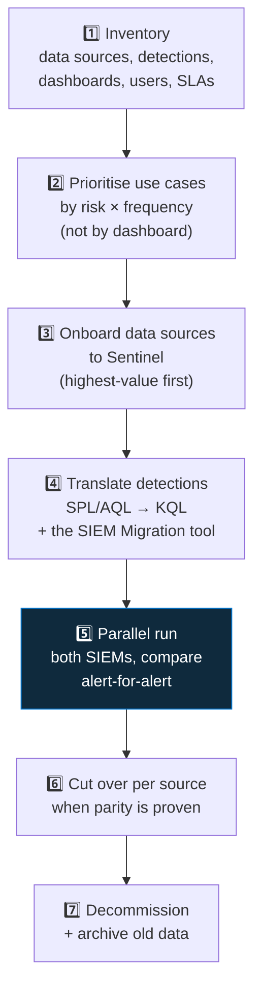

<div align="center">

# 🛰️ Step 60 · SIEM migration

### *Plan a Splunk / QRadar → Sentinel move*

[](../README.md)
[](#)
[-107C10?style=flat-square)](#)

</div>

---

## 🎯 Goal

You've produced a migration plan for a hypothetical Splunk estate: a phased approach, a detection
translation sample (SPL → KQL), a data-source cutover order, and a parallel-run exit criteria.

## 🧠 Why this step

"We're moving off Splunk" is a common real project. Doing it well is a methodology, not a
lift-and-shift: migrate use cases, not dashboards; run in parallel; cut over by data source.

## ✅ Prerequisites

- Phases 📥 and 🔍 done — you know how connectors and rules work in Sentinel

## 🧭 The method



## 🖱️ Do it — use the SIEM Migration experience

1. **Microsoft Sentinel → Content management → SIEM Migration** (or **Content hub → SIEM Migration**).
2. Upload a Splunk export (`savedsearches.conf` / detections). The tool:
   - translates SPL to KQL where it can,
   - maps Splunk data models / sourcetypes to Sentinel tables,
   - flags what needs manual work,
   - can create the analytics rules directly.
3. Review each translation. Note the ones marked "manual" — those are your engineering backlog.

## 💻 Do it — translate one by hand

**Splunk (SPL):**

```
index=wineventlog EventCode=4625
| stats count as failures by src_ip, user
| where failures > 10
| lookup vip_users user OUTPUT tier
| eval severity=if(isnotnull(tier),"high","medium")
```

**Sentinel (KQL):**

```kusto
let vips = _GetWatchlist('VIPUsers') | project user = tolower(UserPrincipalName), tier = Tier;
SecurityEvent
| where TimeGenerated > ago(1h) and EventID == 4625
| summarize failures = count() by src_ip = tostring(IpAddress), user = tolower(TargetUserName)
| where failures > 10
| join kind=leftouter vips on user
| extend severity = iff(isnotempty(tier), "high", "medium")
```

Note the mapping: `index=wineventlog` → `SecurityEvent`, `stats` → `summarize`, `lookup` →
`_GetWatchlist` + `join`, `eval if` → `iff`.

## 🧪 Validate

Produce `artifacts/siem-migration-plan.md` for this scenario:

> *Splunk, 250 GB/day, 400 saved searches (≈120 are actual detections), 30 dashboards, on-prem
> heavy-forwarder tier, MSSP wants out in 6 months.*

It must contain:
- Data-source onboarding order with rationale (identity/endpoint/activity first).
- Which of the 400 saved searches migrate (the ~120 detections) and how the rest are handled.
- A parallel-run plan: duration, the comparison method, and **exit criteria** (e.g. "≥ 95% alert
  parity per source over 2 weeks, no missed true positives").
- Cutover order and rollback.
- What happens to historical Splunk data (archive / cold storage / search-on-demand).

**You should see** a plan that survives the question "what if a detection doesn't translate?" — the
answer is: it goes on the manual backlog and parallel-run continues for that source until it's
built.

## 🚩 Common mistakes

| 🚩 Mistake | Why it bites |
|---|---|
| Migrating dashboards 1:1 | You port Splunk's model instead of designing for KQL/workbooks |
| Big-bang cutover | No safety net; a translation gap = a blind spot in prod |
| Skipping parallel run | You discover parity gaps after the old SIEM is gone |
| Ignoring the auto-translator's "manual" flags | Those are exactly the detections that matter most |

## 🗒️ Log your run

`LOG.md` + `artifacts/siem-migration-plan.md` + your hand-translated rule.

## 📚 Microsoft Learn

- [Plan your migration to Microsoft Sentinel](https://learn.microsoft.com/en-us/azure/sentinel/migration)
- [SIEM migration experience](https://learn.microsoft.com/en-us/azure/sentinel/siem-migration)
- [Splunk to KQL / Sentinel migration guide](https://learn.microsoft.com/en-us/azure/sentinel/migration-splunk-detection-rules)

---

<div align="center">
<sub>

[⬅ Prev: 59 · Anomaly & ML rules](../59-anomaly-and-ml-rules/README.md) &nbsp;·&nbsp; [🦅 All steps](../README.md) &nbsp;·&nbsp; [Next: 61 · IR, purge & audit ➡](../61-ir-purge-and-audit/README.md)

</sub>
</div>
