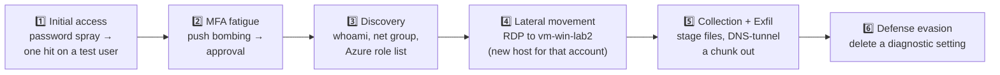

# 🛰️ Step 62 · Capstone

### *One attack, end to end: detect · investigate · hunt · automate · report*

---

## 🎯 Goal

You run a single multi-stage attack in your lab, and your Sentinel SOC — the one you built across
steps 00–61 — detects it, correlates it into one incident, an automation enriches it, you hunt for
what the rules missed, you contain it with an approved playbook, and you write the report.

## 🧠 Why this step

Every earlier step proved one capability in isolation. This proves the **system**. It's also the
artifact you show in an interview.

## ✅ Prerequisites

- Everything. Realistically: phases 🧱 📥 🔍 done, plus steps 30/33/34 (playbooks), 40–49 (hunting),
  27 (rule health).
- Two lab VMs, test users, an isolated VNet.

## 🎭 The scenario — "contractor laptop to data theft"

## 🖱️ Run it (all in the isolated lab)

| Stage | Action | Should trip |
|---|---|---|
| 1 | Fail sign-in for 8 test users once each from one IP, succeed on `capstone-victim` | password-spray template rule |
| 2 | Trigger 6 MFA prompts for `capstone-victim`, deny 5, approve 1 | HUNT-IDENTITY-001 (MFA fatigue) — promote to rule first if you want it to alert |
| 3 | On `vm-win-lab`: `whoami /all`, `net group "Domain Admins" /domain`, `az role assignment list` | endpoint hunt / discovery |
| 4 | RDP from `vm-win-lab` to `vm-win-lab2` as `capstone-victim` | HUNT-LATERAL (new host pair) / DET rule if promoted |
| 5 | Stage a folder, then run the step-47 DNS-tunnel simulation from `vm-win-lab2` | DET-EXFIL-001 (from step 49) |
| 6 | `az monitor diagnostic-settings delete ...` on a lab resource | HUNT-CLOUD (diagnostic tamper) |

## 🔍 Then work it like an analyst

1. **Triage** the incident(s). Did grouping (step 21) collapse them into one story, or several? Fix
   the grouping if not.
2. **Investigation graph** — walk victim → IP → host2 → exfil domain. Note entity insights + UEBA
   score (step 51).
3. **Timeline** — build the attacker timeline from `SecurityAlert` + `AuditLogs` + `Device*` +
   bookmarks.
4. **Hunt the gaps** — what stage produced *no* alert? That's a detection to build (step 49) and a
   finding for the report.
5. **Contain** — run `PB-Contain-User-Approval` (step 34), approve, confirm `accountEnabled=false`
   and sessions revoked.
6. **Automation review** — did `PB-Enrich-IP-Reputation` add the exfil domain reputation? Did
   automation rules assign/tag correctly?

## 🧪 Validate — the report

Write `artifacts/CAPSTONE-report.md` using
[`_templates/HUNT-TEMPLATE.md`](../_templates/HUNT-TEMPLATE.md) ideas + an IR structure:

- **Executive summary** — 4 sentences a manager reads.
- **Timeline** — table: time, stage, technique (ATT&CK ID), evidence (query/table).
- **What detected it** — per stage: which rule/hunt, latency, or "missed — gap".
- **What was missed and why** — honest. Each gap → a new `DET-*` or connector ask.
- **Containment** — what the playbook did, when, who approved.
- **Automation performance** — enrichment, grouping, assignment: worked / didn't.
- **Recommendations** — ranked. New detections, tuning, connector gaps, cost impact.
- **Evidence** — redacted screenshots + the KQL for every claim.

**You should see** a report where every "detected at HH:MM by rule X" is backed by a real
`SecurityAlert` row, and every gap has a concrete fix. If a stage's detection is "should have
fired", it didn't — say so and build it.

## 🚩 Common mistakes

| 🚩 Mistake | Why it bites |
|---|---|
| Claiming detections that didn't fire | The honesty rule — go build the missing one instead |
| One incident per stage, no correlation | Fix grouping/entity mapping; a real analyst needs one story |
| No timeline | The report's spine is the timeline |
| Skipping the "what was missed" section | That's the most valuable part — it's your backlog |
| Leaving the lab running | Tear down; capture cost |

## 🗒️ Log your run

`LOG.md` + `artifacts/CAPSTONE-report.md` + evidence folder. Tick the capstone milestone in
[`ROADMAP.md`](../ROADMAP.md).

## 📚 Microsoft Learn

- [Investigate incidents with Microsoft Sentinel](https://learn.microsoft.com/en-us/azure/sentinel/investigate-incidents)
- [Navigate and investigate incidents](https://learn.microsoft.com/en-us/azure/sentinel/incident-investigation)
- [Conduct end-to-end threat hunting with hunts](https://learn.microsoft.com/en-us/azure/sentinel/hunts)
- [Incident response with the unified SecOps platform](https://learn.microsoft.com/en-us/unified-secops-platform/respond-incidents)

---

[⬅ Prev: 61 · IR, purge & audit](../61-ir-purge-and-audit/README.md) &nbsp;·&nbsp; [🦅 All steps](../README.md)

  

**You built a SOC. Now go operate one.**

