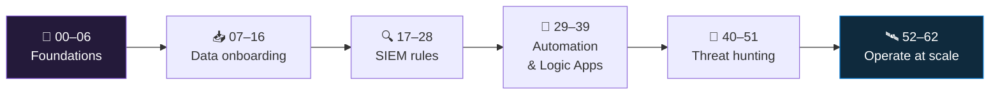

<div align="center">

<h1>
🦅&nbsp; Microsoft Sentinel — Live Learning
</h1>

<h3>
<em>From an empty Azure subscription to a working Sentinel SOC — one step at a time</em>
</h3>

<p>
<b>63 hands-on steps · 00 → 62 · L0 to advanced</b><br>
<sub>One straight line. Every step is something you do in a real workspace, then prove. Every step links to Microsoft Learn. Nothing here is a copy of the docs.</sub>
</p>

[](#-the-line)
[](00-azure-subscription-and-tenant/README.md)
[](https://learn.microsoft.com/en-us/azure/sentinel/)
[](06-cost-model-and-budget/README.md)

</div>

---

## 🎯 What this is

A **single ordered path**. You start at step `00` with nothing but an Azure account. You finish at
step `62` with a Sentinel SOC you built yourself: telemetry flowing, detections you wrote, playbooks
that respond, hunts you ran, and the write-ups to prove all of it.

Each step folder has one `README.md` that tells you **what to click**, **what to run as code**, and
**how to prove it worked** — the exact query, and the output you should see. Do them in order. Tick a
step when its **Validate** block passes, not when you have read it.

> [!NOTE]
> Companion to the broader
> [Azure Security Engineer Path](https://github.com/TaruntejaDesireddy/azure-security-engineer-path)
> — that repo explains the concepts across all of AZ-500 / SC-200. **This one is Sentinel only, and
> you learn it by building it.**

---

## 🧗 The climb



---

## 📋 The line

### 🧱 Foundations — *before you touch Sentinel*

| # | Step | You will |
|:--:|---|---|
| <sub>&#9744;</sub> `00` | [Azure subscription & tenant](00-azure-subscription-and-tenant/README.md) | Stand up an isolated lab subscription, resource group, CLI |
| <sub>&#9744;</sub> `01` | [Log Analytics workspace](01-log-analytics-workspace/README.md) | Create the workspace Sentinel is built on |
| <sub>&#9744;</sub> `02` | [Enable Sentinel](02-enable-sentinel/README.md) | Turn Sentinel on, deliberately |
| <sub>&#9744;</sub> `03` | [Navigating Sentinel](03-navigating-sentinel/README.md) | Every blade, and what it's for |
| <sub>&#9744;</sub> `04` | [KQL survival kit](04-kql-survival-kit/README.md) | The 12 operators you'll use every day |
| <sub>&#9744;</sub> `05` | [RBAC and roles](05-rbac-and-roles/README.md) | Assign the four Sentinel roles correctly |
| <sub>&#9744;</sub> `06` | [Cost model and budget](06-cost-model-and-budget/README.md) | Know what drives the bill; set a budget alert |

### 📥 Data onboarding — *get telemetry in*

| # | Step | You will |
|:--:|---|---|
| <sub>&#9744;</sub> `07` | [Connectors & Content hub](07-connectors-and-content-hub/README.md) | The two things a connector installs |
| <sub>&#9744;</sub> `08` | [Azure Activity](08-azure-activity/README.md) | Connect the control-plane log |
| <sub>&#9744;</sub> `09` | [Microsoft Entra ID](09-microsoft-entra-id/README.md) | Sign-in and audit logs |
| <sub>&#9744;</sub> `10` | [Defender XDR](10-defender-xdr/README.md) | XDR incidents + raw hunting tables |
| <sub>&#9744;</sub> `11` | [Windows VM (AMA + DCR)](11-windows-vm-ama-dcr/README.md) | Security events from a VM |
| <sub>&#9744;</sub> `12` | [Linux syslog / CEF (AMA)](12-linux-syslog-cef-ama/README.md) | Syslog and CEF appliance data |
| <sub>&#9744;</sub> `13` | [Custom logs + DCR transformations](13-custom-logs-and-dcr-transformations/README.md) | Ingest a custom log; shape it at ingest |
| <sub>&#9744;</sub> `14` | [API & codeless connectors](14-api-and-codeless-connectors/README.md) | Pull a third-party feed, no agent |
| <sub>&#9744;</sub> `15` | [Ingestion health & validation](15-ingestion-health-and-validation/README.md) | Confirm flow; catch silent gaps |
| <sub>&#9744;</sub> `16` | [Retention, archive & data lake](16-retention-archive-and-data-lake/README.md) | Analytics / basic / archive per table |

### 🔍 SIEM rules — *turn logs into incidents*

| # | Step | You will |
|:--:|---|---|
| <sub>&#9744;</sub> `17` | [Analytics rule types](17-analytics-rule-types/README.md) | Scheduled, NRT, Fusion, MS Security, anomaly |
| <sub>&#9744;</sub> `18` | [Enable a rule from a template](18-enable-a-rule-from-template/README.md) | Ship a detection in 5 minutes |
| <sub>&#9744;</sub> `19` | [Write a scheduled rule](19-write-a-scheduled-rule/README.md) | Brute-force rule from scratch |
| <sub>&#9744;</sub> `20` | [Entity mapping & custom details](20-entity-mapping-and-custom-details/README.md) | Make incidents correlate and read well |
| <sub>&#9744;</sub> `21` | [Alert & event grouping](21-alert-and-event-grouping/README.md) | Control how alerts become incidents |
| <sub>&#9744;</sub> `22` | [Scheduling, lookback & coverage gaps](22-scheduling-lookback-and-coverage-gaps/README.md) | Align query window with run frequency |
| <sub>&#9744;</sub> `23` | [NRT rules](23-nrt-rules/README.md) | Near-real-time detection and its limits |
| <sub>&#9744;</sub> `24` | [Watchlists](24-watchlists/README.md) | Build a reference list; use it in a rule |
| <sub>&#9744;</sub> `25` | [MITRE ATT&CK coverage](25-mitre-attack-coverage/README.md) | Map rules to techniques; read the matrix |
| <sub>&#9744;</sub> `26` | [Tuning a noisy rule](26-tuning-a-noisy-rule/README.md) | 200 alerts/day → 3 |
| <sub>&#9744;</sub> `27` | [Rule health monitoring](27-rule-health-monitoring/README.md) | Catch a rule that silently stopped |
| <sub>&#9744;</sub> `28` | [Analytics rules as code](28-analytics-rules-as-code/README.md) | Export, version, redeploy |

### 🔄 Automation & Logic Apps — *respond without a human*

| # | Step | You will |
|:--:|---|---|
| <sub>&#9744;</sub> `29` | [Automation rules vs playbooks](29-automation-rules-vs-playbooks/README.md) | Which one does what |
| <sub>&#9744;</sub> `30` | [Your first playbook (notify)](30-first-playbook-notify/README.md) | Post an incident to Teams / email |
| <sub>&#9744;</sub> `31` | [The Sentinel connector](31-sentinel-connector-triggers-and-actions/README.md) | Triggers and actions, in detail |
| <sub>&#9744;</sub> `32` | [Playbook managed identity & permissions](32-playbook-managed-identity-and-permissions/README.md) | Least-privilege for a playbook |
| <sub>&#9744;</sub> `33` | [Enrich an incident](33-enrich-an-incident/README.md) | Auto-add IP reputation + a comment |
| <sub>&#9744;</sub> `34` | [Response actions with approval](34-response-actions-with-approval/README.md) | Disable a user / isolate a device, gated |
| <sub>&#9744;</sub> `35` | [Automation rules for triage](35-automation-rules-triage/README.md) | Assign, tag, re-severity, suppress |
| <sub>&#9744;</sub> `36` | [Alert vs incident vs entity triggers](36-alert-vs-incident-vs-entity-triggers/README.md) | Pick the right playbook trigger |
| <sub>&#9744;</sub> `37` | [Guardrails and conditions](37-guardrails-and-conditions/README.md) | Stop a playbook doing damage |
| <sub>&#9744;</sub> `38` | [Playbooks as code](38-playbooks-as-code/README.md) | ARM-template a playbook, redeploy |
| <sub>&#9744;</sub> `39` | [Monitoring playbook runs & cost](39-monitoring-playbook-runs-and-cost/README.md) | Find failed runs; understand pricing |

### 🏹 Threat hunting — *look before you're told*

| # | Step | You will |
|:--:|---|---|
| <sub>&#9744;</sub> `40` | [Hunting mindset & hypotheses](40-hunting-mindset-and-hypotheses/README.md) | Write a testable hunt hypothesis |
| <sub>&#9744;</sub> `41` | [The Hunting blade](41-the-hunting-blade/README.md) | Queries, MITRE, run-all, results |
| <sub>&#9744;</sub> `42` | [Bookmarks](42-bookmarks/README.md) | Capture evidence; promote to incident |
| <sub>&#9744;</sub> `43` | [Livestream](43-livestream/README.md) | Watch a query in near-real-time |
| <sub>&#9744;</sub> `44` | [Hunt: identity](44-hunt-identity/README.md) | MFA fatigue, impossible travel, OAuth consent |
| <sub>&#9744;</sub> `45` | [Hunt: endpoint](45-hunt-endpoint/README.md) | LOLBins, encoded PowerShell, persistence |
| <sub>&#9744;</sub> `46` | [Hunt: lateral movement](46-hunt-lateral-movement/README.md) | RDP / SMB / remote service patterns |
| <sub>&#9744;</sub> `47` | [Hunt: exfiltration](47-hunt-exfiltration/README.md) | Rare destinations, big egress, DNS tunneling |
| <sub>&#9744;</sub> `48` | [Hunt: cloud control plane](48-hunt-cloud-control-plane/README.md) | Role grants, Key Vault, NSG changes |
| <sub>&#9744;</sub> `49` | [Hunt → detection](49-hunt-to-detection/README.md) | Convert a good hunt into a scheduled rule |
| <sub>&#9744;</sub> `50` | [Notebooks & MSTICPy](50-notebooks-and-msticpy/README.md) | Run a hunting notebook on the workspace |
| <sub>&#9744;</sub> `51` | [UEBA & entity behavior](51-ueba-and-entity-behavior/README.md) | Enable UEBA; use the behavior tables |

### 🛰️ Operate at scale — *advanced*

| # | Step | You will |
|:--:|---|---|
| <sub>&#9744;</sub> `52` | [Unified SecOps (Defender portal)](52-unified-secops-defender-portal/README.md) | Run Sentinel from the Defender portal |
| <sub>&#9744;</sub> `53` | [Workspace architecture](53-workspace-architecture/README.md) | One workspace or many — decide it properly |
| <sub>&#9744;</sub> `54` | [Multi-tenant & Lighthouse](54-multi-tenant-and-lighthouse/README.md) | The MSSP / multi-tenant SOC model |
| <sub>&#9744;</sub> `55` | [Repositories & CI/CD](55-repositories-cicd/README.md) | Deploy all Sentinel content from Git |
| <sub>&#9744;</sub> `56` | [Cost engineering](56-cost-engineering/README.md) | Commitment tiers, basic logs, ingest-time filtering |
| <sub>&#9744;</sub> `57` | [SOC optimization & coverage](57-soc-optimization-and-coverage/README.md) | Use the SOC optimization recommendations |
| <sub>&#9744;</sub> `58` | [Threat intelligence](58-threat-intelligence/README.md) | TAXII, the upload API, TI in rules |
| <sub>&#9744;</sub> `59` | [Anomaly & ML rules](59-anomaly-and-ml-rules/README.md) | Customize a built-in anomaly rule |
| <sub>&#9744;</sub> `60` | [SIEM migration](60-siem-migration/README.md) | Plan a Splunk / QRadar → Sentinel move |
| <sub>&#9744;</sub> `61` | [IR, purge & audit](61-ir-purge-and-audit/README.md) | Data purge, GDPR, auditing Sentinel itself |
| <sub>&#9744;</sub> `62` | [Capstone](62-capstone/README.md) | One attack: detect, hunt, automate, report |

---

## 🚀 Start

```bash
az login
az account set --subscription "<your-lab-subscription>"
az extension add --name sentinel
```

Then open [`00-azure-subscription-and-tenant/README.md`](00-azure-subscription-and-tenant/README.md).

---

## 📁 How each step is laid out

| Section | What it gives you |
|---|---|
| 🎯 **Goal** | One sentence — what is true at the end |
| 🧠 **Why this step** | Where it fits in the line |
| ✅ **Prerequisites** | Which earlier steps must be done |
| 🧭 **Concepts in 60 seconds** | Just enough theory |
| 🖱️ **Do it — portal** | The click-path, in order |
| 💻 **Do it — CLI / IaC** | The same thing as code |
| 🧪 **Validate** | The query to run and the output you should see |
| 🚩 **Common mistakes** | What goes wrong, and why |
| 🗒️ **Log your run** | Copy [`_templates/STEP-LOG-TEMPLATE.md`](_templates/STEP-LOG-TEMPLATE.md) into the folder |
| 📚 **Microsoft Learn** | The official pages |

---

## 💸 Cost

Designed to run inside the **Log Analytics / Sentinel free allowances** if you tear resources down
between sessions. The two things that can surprise you: **VM ingestion volume** and an **idle VM**.
[Step 06](06-cost-model-and-budget/README.md) sets a budget alert before anything that bills exists,
and every step states its cost up front.

> [!IMPORTANT]
> This is a lab. Use an **isolated subscription** with nothing real in it. Never point real user
> data, production hostnames or real secrets at anything here. Redact tenant IDs, subscription IDs,
> UPNs and IPs from every screenshot before committing.

---

## 🧾 Honesty rule

> **Never record a step as done before it is.** No invented screenshots, no invented query output,
> no invented incidents. An honest empty checkbox is worth more than a dishonest tick.

---

<div align="center">
<sub>

[🗺️ Roadmap](ROADMAP.md) &nbsp;·&nbsp; [🤝 Contributing](CONTRIBUTING.md) &nbsp;·&nbsp; [🔐 Security](SECURITY.md) &nbsp;·&nbsp; [📜 Changelog](CHANGELOG.md)

</sub>
</div>
